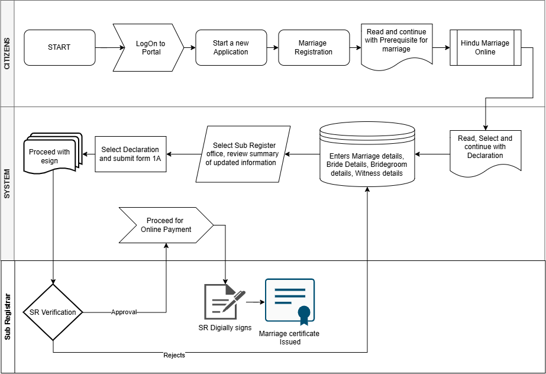
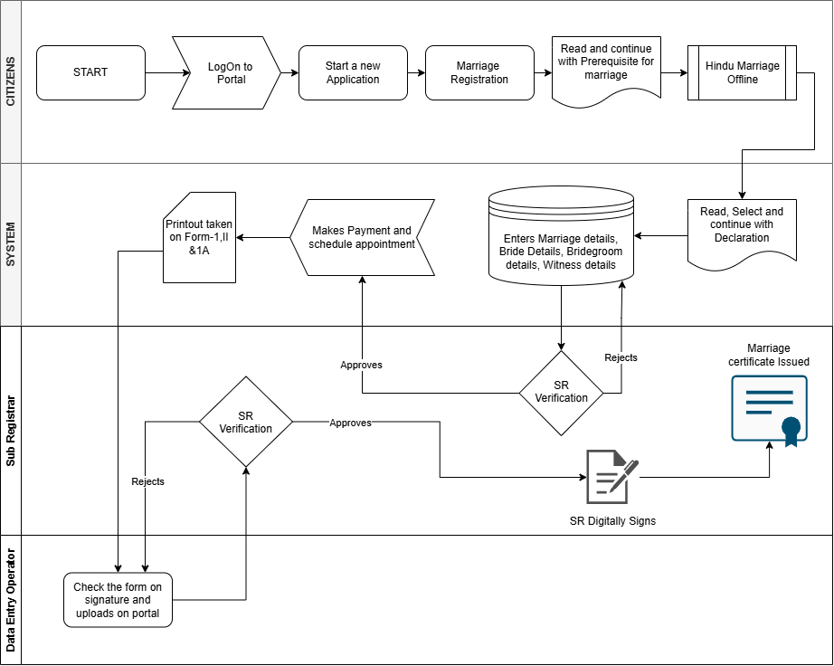

# Business Requirements Document (BRD) — Template

## Marriage Registration Module — Hindu Marriage (Kaveri 3.0)

| Field | Value |
|--------|--------|
| **Document ID** | BRD-K3-MRG-HMA-001 |
| **Version** | 0.4 (Draft — statutory citations added) |
| **Status** | Draft / In review / Approved |
| **Module** | Marriage Registration |
| **Legal basis (primary)** | The Hindu Marriage Act, 1955 (Central Act 25 of 1955) |
| **State rules (primary)** | Registration of Hindu Marriage (Karnataka) Rules, 1966 |
| **Related inputs** | `Marriage/Hindu Marriage Act, 1955.pdf`; `Marriage/REGISTRATIONOFHINDUMARRIAGE_KARNATAKARULES_1966.docx`; `Marriage/hindu marriage forms.pdf`; `Marriage/Form1.pdf`; `Marriage/RD48MNMU2023-Notification-marriage.pdf` (**RD/48/MNMU/2023**, Karnataka Gazette 06-Feb-2024 — Amendment Rules 2024) |
| **Author (BA)** | [Name] |
| **Product Owner** | [Name] |
| **Domain expert / SRO reviewer** | [Name] |
| **Target audience** | PO, BA, Domain Expert, Solution Architect, Dev, QA, Content |
| **Last updated** | 20-Aug-2026 |

---

## Document control

| Version | Date | Author | Summary of change | Approver |
|---------|------|--------|-------------------|----------|
| 0.1 | [Date] | [BA] | Initial template / discovery draft | [PO] |
| 0.2 | [Date] | [BA] | Added detailed non-functional requirements (§13.1–13.11) | [PO] |
| 0.3 | [Date] | [BA] | **Aligned To-Be process with approved Hindu Marriage Online & Offline process diagrams** — channel model, eSign, appointment, printout, DEO role, two-stage SR verification, payment-after-approval (§4, §5, §7, §8.14–8.19, §9, §10, §11, §12, §13, §15, §16) | [PO] |
| 0.4 | 20-Aug-2026 | [BA] | **Added citations** from HMA 1955, Karnataka Rules 1966 (as amended), Form I/IA/II/II-A/III, S.O. 4896 (Sub-Registrar appointment), and **RD/48/MNMU/2023** Amendment Rules 2024 (electronic memorandum / register / certificate filing) throughout §§2–3, 7–9, 11, 15 and Appendices D–E | [PO] |

**Distribution:** [Confluence space / SharePoint link]

**Related documents:**

| ID | Title | Link |
|----|--------|------|
| BRD-K3-MRG-HMA-001 | This document | |
| PROC-K3-MRG-HMA-ASIS-001 | As-Is process (Hindu registration) | [TBD] |
| PROC-K3-MRG-HMA-TOBE-001 | To-Be process flows | `ProcessDiagrams/Hindu_Marriage_Online.png`, `ProcessDiagrams/Hindu_Marriage_Offline.png` |
| RTM-K3-MRG-HMA-001 | Requirements traceability matrix | [TBD] |
| DEC-K3-MRG-001 | Decision log | [TBD] |
| BRD-K3-MRG-SMA-001 | Special Marriage (separate BRD) | Out of scope for this template unless merged |

---

## 1. Executive summary

**Purpose:** [2–3 sentences — e.g. Enable citizens and Sub-Registrars to register Hindu marriages under Section 8 of the Hindu Marriage Act, 1955, per Karnataka Rules 1966, through Kaveri 3.0 with statutory forms, fees, audit trail, and certificate issuance.]

**Business problem:** [Current pain points from Kaveri 2.0 / manual process — queues, rework, jurisdiction errors, document gaps, Kannada UX, etc.]

**Proposed solution (high level):** [Citizen online application → document upload → fee → SRO scrutiny → register memorandum → Form II-A certificate; optional counter/SRO-assisted path.]

**Success criteria (measurable):** [e.g. % applications registered within X working days; reduction in rejection/rework; statutory compliance sign-off from Domain Expert.]

**Phase / MVP boundary:** [Confirm with PO — Hindu post-solemnization registration only in Phase 1; exclude divorce/nullity workflows unless explicitly in scope.]

---

## 2. Scope

### 2.1 In scope (Hindu Marriage — Phase [1])

- Registration of **already solemnized** Hindu marriages under **HMA 1955 §8** *(Central Act 25 of 1955)* — particulars entered in Hindu Marriage Register; validity of marriage not affected by omission to register (**§8(5)**).
- Statutory artefacts (Karnataka Rules 1966 schedules / `Marriage/hindu marriage forms.pdf`): **Form I** (*See Rule 4* — Memorandum), **Form IA** (*See rule 4(2)* — Application), **Form II** (*Rule 4(4)* — endorsement), **Form II-A** (*See rule 4(5)* — Certificate), **Form III** (*Rule 5(1)* — monthly duplicate certificate to Registrar-General).
- Jurisdiction: place of marriage **or** ordinary residence of bride/bridegroom (**Rule 4(1)**, as substituted/amended; parents-of language omitted by 1999 Amendment).
- Parties: bride, bridegroom, **three witnesses** — memorandum and duplicate signed by three witnesses (**Rule 4(3)**); *witness* = person present at solemnisation (**Rule 2**, 1999 Amendment).
- Citizen portal + SRO desk workflows: apply, pay fee, scrutiny, approve/reject, register, issue certificate, reprint/corrected extract (per rules).
- **Two processing channels per approved process diagrams (§7):** *Hindu Marriage Online* (citizen eSign, single SR verification) and *Hindu Marriage Offline* (payment + appointment, printout of Form I / II / 1A, physical signature, Data Entry Operator upload, two-stage SR verification). Online/electronic path is supported by **RD/48/MNMU/2023** (Amendment Rules 2024) inserting “or electronically” into Rule 4(1), “or stored electronically” into Rule 4(4), and “or stored in electronic media” into Rule 4(5).
- Integrations: [payment, Aadhaar/eKYC, DigiLocker, SMS — mark TBD per PO].
- Bilingual UI: English + Kannada (labels, certificate text where mandated).
- Audit trail, role-based access, MIS/reporting for department.

### 2.2 Out of scope (unless PO promotes)

- Special Marriage Act 1954 (separate BRD).
- Parsi / Christian / Muslim marriage Acts.
- Matrimonial petitions (divorce, judicial separation, restitution) under HMA Part III onward.
- Priest-led solemnization scheduling (unless department requires).
- Legacy data migration detail (flag for Data Migration specialist; high-level requirements only here).

### 2.3 Assumptions

| ID | Assumption | Owner to validate |
|----|------------|-------------------|
| A-01 | Sub-Registrars under the Indian Registration Act, 1908 act as **Registrars of Hindu Marriages** for their local areas — **S.O. 4896**, Notification No. HD 6 CIM 61 dated 4 July 1966 (under **Rule 3(1)**) | Domain Expert |
| A-02 | Registration is facilitative under **HMA §8(1)**; omission does not affect validity (**§8(5)**); compulsory only if State so directs under **§8(2)**. Once parties choose Kaveri registration, process rules (Forms I/IA etc.) apply | Legal / DE |
| A-03 | Joint photograph of bride and bridegroom on **Form I** header (*To be attested by bride and bridegroom*) — `Marriage/Form1.pdf` / `hindu marriage forms.pdf` | DE / SRO |
| A-04 | Fee schedule follows Karnataka Rules **Schedule** (*See rule 8*) + any later fee amendments; **RD/48/MNMU/2023** amends Rule 4 for electronic mode (not the fee schedule itself) | Treasury / DE |
| A-05 | [TBD] | |

### 2.4 Constraints

- GIGW / MeitY guidelines, accessibility (WCAG 2.x), Karnataka e-Gov hosting/security norms.
- Aadhaar / eKYC usage only as approved by department and UIDAI compliance.
- No alteration of statutory form **wording** on generated outputs without legal approval.

---

## 3. Legal and regulatory reference

> **Citation convention:** *Act* = The Hindu Marriage Act, 1955 (Central Act 25 of 1955) — source `Marriage/Hindu Marriage Act, 1955.pdf`. *Rules* = Registration of Hindu Marriage (Karnataka) Rules, 1966 — source `Marriage/REGISTRATIONOFHINDUMARRIAGE_KARNATAKARULES_1966.docx`. *Forms* = `Marriage/hindu marriage forms.pdf`, `Marriage/Form1.pdf`. *Notification RD/48* = Karnataka Gazette Part-IVA No. 60 dated **06-Feb-2024**, No. **RD/48/MNMU/2023** — Registration of Hindu Marriage (Karnataka) (Amendment) Rules, 2024 — source `Marriage/RD48MNMU2023-Notification-marriage.pdf`.

### 3.1 Primary legislation — Hindu Marriage Act, 1955 (selected sections for registration)

| Section | Topic | Pin cite / statutory gist | BRD relevance | Source |
|---------|--------|---------------------------|---------------|--------|
| 2 | Application of Act | Applies to Hindus (incl. Virashaiva, Lingayat, Brahmo/Prarthana/Arya Samaj), Buddhists, Jainas, Sikhs; certain others not Muslim/Christian/Parsi/Jew; **does not apply** to Scheduled Tribes (Art. 366(25)) unless Central Govt. notifies | Who may use Hindu marriage registration module | `Hindu Marriage Act, 1955.pdf` |
| 3 | Definitions | *custom/usage*; *sapinda relationship* (3rd gen. through mother, 5th through father); *degrees of prohibited relationship* (lineal ascendants, certain affinity & collateral relationships) | Validation / SRO review rules; sapinda & prohibited-relationship capture | same |
| 5 | Conditions for a Hindu marriage | Marriage may be solemnized between two Hindus if conditions (i)–(v) fulfilled | Form IA declaration (II); age & marital-status validations | same |
| 7 | Ceremonies for a Hindu marriage | Solemnized per **customary rites and ceremonies** of either party; if *Saptapadi* included, marriage complete on seventh step | Ceremony/rites capture; solemnization evidence | same |
| 8 | Registration of Hindu marriages | **(1)** State may make rules for entry of particulars in Hindu Marriage Register; **(2)** may make compulsory with fine ≤ ₹25; **(3)** rules laid before Legislature; **(4)** register open for inspection, admissible as evidence, certified extracts on fee; **(5)** **validity of marriage not affected by omission to make the entry** | Core registration authority; Karnataka Rules power; optional vs compulsory; certificate/extract basis | same |
| 11–12 | Void / voidable marriages | Void if §§5(i),(iv),(v) breached (petition); voidable on consent/force/fraud/etc. | Optional SRO flags only — **not** court nullity workflow | same |
| 17 | Punishment of bigamy | Marriage void if spouse living; IPC §§494–495 apply | Messaging linked to §5(i) declaration | same |
| 18 | Punishment for other §5 breaches | Contravention of §5(iii) (age): RI ≤ 2 yrs or fine ≤ ₹1 lakh or both; §5(iv)/(v): SI ≤ 1 month or fine ≤ ₹1000 or both | Citizen/SRO awareness; not automated prosecution | same |

**Section 5 — conditions (for business rules table):**

| Condition | Statutory requirement (pin cite) | System handling (To-Be) |
|-----------|----------------------------------|-------------------------|
| 5(i) | “neither party has a spouse living at the time of the marriage” | Mandatory declaration + [TBD: document / cross-check]; link to §17 bigamy messaging |
| 5(ii) | Valid consent; not incapable by unsoundness of mind / mental disorder / recurrent insanity (as substituted by Act 68 of 1976; epilepsy words omitted Act 39 of 1999) | Declaration; SRO may refuse under Rules scrutiny |
| 5(iii) | Bridegroom completed **21 years**; bride **18 years** at time of marriage (ages substituted by Act 2 of 1978) | DOB/age validation vs marriage date — FR-HMA-003 |
| 5(iv) | Not within degrees of prohibited relationship unless custom/usage permits | [TBD: relationship capture + rule engine / manual] — OQ-003 |
| 5(v) | Not sapindas of each other unless custom/usage permits | [TBD: as above] |

**Section 7 (pin cite):** “A Hindu marriage may be solemnized in accordance with the customary rites and ceremonies of either party thereto.” Capture ceremony type/description; SRO verification.

**Section 8 (pin cite — registration engine):** State rules under §8(1) drive Forms I/IA/II/II-A, register, fees and extracts; §8(4) supports certified extracts; §8(5) clarifies registration is **not** constitutive of validity.

### 3.2 Karnataka Rules, 1966 (operational rules)

*Made under HMA §8(1); G.S.R. 911 dated 10 March 1966; published Karnataka Gazette 28 April 1966, Part IV Section 2-C-1, pp. 1089–1096.*

| Rule | Requirement (pin cite) | System feature | Source |
|------|------------------------|----------------|--------|
| 2 | Definitions: *Act*, *form*, *Marriage* (= marriage between two Hindus fulfilling §§5 & 7), *Memorandum*, *Priest*, *Register*, *Registrar*, *Registrar-General*, *witness* (present at solemnisation) | Glossary / validation of “Hindu marriage” eligibility | Rules 1966 docx |
| 3(1) + S.O. 4896 | State appoints Registrars; **all Sub-Registrars** under Registration Act 1908 appointed Registrars for their jurisdictions (HD 6 CIM 61, 4 Jul 1966) | Office/jurisdiction master; route to correct SRO | Rules 1966 + notification text therein |
| 4(1) | Parties may enter particulars; prepare & sign **Form I in duplicate**; deliver **in person** or **registered post** **or electronically** (*“or electronically” inserted by RD/48/MNMU/2023*); jurisdiction = area where marriage took place **or** bridegroom/bride ordinarily reside | Dual-copy / electronic filing; office selection | Rules 1966; RD/48 |
| 4(2) | Every memorandum delivered/sent **along with application in Form IA** | Linked application record | Rules 1966 |
| 4(3) | Memorandum and duplicate **signed by three witnesses** | Three witness records + eSign / physical signature | Rules 1966 (1999 subst.) |
| 4(4) | Endorsement in **Form II** on reverse; paste memorandum in paste-book register (serial blank butts from 1) **or stored electronically** (RD/48) | Serial no., page, volume **or** electronic register entry | Rules 1966; RD/48 |
| 4(5) | On filing memorandum + application (**or stored in electronic media** — RD/48) and completion of registration, **immediately** issue **Form II-A** certificate; communicate in person or by post | Certificate PDF + download / post / counter | Rules 1966 (1999); RD/48 |
| 5(1)–(2) | By **5th of each month**, send **duplicate** memoranda of preceding month to Registrar-General with **Form III** certificate; RG pastes into similar register; indexes Forms IV & V | Monthly batch / Form III export | Rules 1966; Form III in forms PDF |
| 6 | Indices Forms IV & V at every Registrar | Search / MIS indexes | Rules 1966 |
| 6A / defect powers (*Registrars Power…*) | (1) Require duplicate / Form IA / remedy defects in reasonable time; (2) if marriage outside jurisdiction, **forward** to correct Registrar with intimation; (3) **scrutinise** memorandum + Form IA; if incomplete, **refuse** and pass **brief written order** to parties | Defect workflow; forward; refusal letter — FR-HMA-101/102/186 | Rules 1966 (1999 inserts) |
| 8 (*Grant of Certified Extracts*) | Certified extracts on application + fee in **Schedule**; provisos on joint photo / photocopy | Certified extract service; fee master | Rules 1966 |
| Schedule (*See rule 8*) | Certified copy of memorandum/identity slip ₹10; Form VII copy ₹10; refusal-order copy ₹10; application ₹5; search ₹5/year; **no search fee** if certified-copy application presented **with** marriage application | Fee calculation — FR-HMA-090/092 | Rules 1966 Schedule tables |
| 9 | Receipt in **Form VI** for every fee; credit to State Government account | Payment receipt / reconciliation | Rules 1966 |
| 10(2) | Registers and indices of Registrar and Registrar-General **preserved permanently** | Retention NFR — NFR-HMA-PRIV-003 | Rules 1966 |
| 10(3) Table | Retention periods for receipt books, postal acknowledgements, extract applications, accounts, cash book, other records | Archival policy mapping | Rules 1966 Table |

### 3.3 Statutory forms mapping

| Form | Rule / Act ref | Purpose (pin cite) | Generated by | Source file |
|------|----------------|--------------------|--------------|-------------|
| Form I | Rule 4; *See Rule : 4* | Memorandum of marriage (duplicate); joint photo attested by bride & bridegroom; items 1–7 (date, place, bridegroom, bride, 3 witnesses) | System from captured data + joint photo | `Form1.pdf`, `hindu marriage forms.pdf` |
| Form IA | Rule 4(2); *See rule 4(2)* | Application for filing of marriage memorandum; declarations (I) valid & registrable under **§8**; (II) **§5** conditions satisfied; (III) particulars true; husband & wife signatures | System + party signatures / eSign | `hindu marriage forms.pdf` |
| Form II | Rule 4(4) | Endorsement on reverse: date received; Serial No.; page; volume of Register under HMA 1955; Registrar signature | SRO on registration / DSC | `hindu marriage forms.pdf` |
| Form II-A | Rule 4(5); *See rule 4(5)* | Certificate of Registration of Marriage under HMA 1955 — names/parentage, solemnisation date, registration date, station, seal | System on approval | `hindu marriage forms.pdf` |
| Form III | Rule 5(1) | Certificate affixed to monthly duplicate memoranda bundle (Sl. No. range for month) | Back-office batch | `hindu marriage forms.pdf` |
| Form IV / V | Rules 5(2), 6 | Indices of register entries | Reporting / search | Rules text |
| Form VI | Rule 9 | Fee receipt | Payment integration | Rules text |

### 3.4 Notifications, circulars and amendments (Marriage folder)

| Instrument | Date / No. | Effect | BRD relevance | Source |
|------------|------------|--------|---------------|--------|
| S.O. 4896 / HD 6 CIM 61 | 4 Jul 1966 | Appoints all Sub-Registrars as Registrars of Hindu Marriages for their jurisdictions | A-01; office master | Embedded in Rules 1966 docx |
| Registration of Hindu Marriages (Karnataka) (Amendment) Rules, 1999 | w.e.f. 8-6-2000 | Inserts *Priest* / *witness* defs; Form IA; three-witness signing; Form II-A immediate certificate; scrutiny/refusal order; Schedule fees; omits “parents of” from jurisdiction | Forms IA & II-A; FR scrutiny | Rules 1966 docx amendment notes |
| G.S.R. 314 / G.S.R. 394 / HD 5 PIM 69 | 1968–1969 | Substitutions/additions to Rule 4 jurisdiction & memorandum clauses | Historical Rule 4(1) text | Rules 1966 docx |
| **RD/48/MNMU/2023** — Registration of Hindu Marriage (Karnataka) (**Amendment**) Rules, **2024** | Gazette 06-Feb-2024, Part-IVA No. 60; made under HMA **§8(1)** | Amends **Rule 4**: (i) insert “**or electronically**” after registered post in r.4(1); (ii) insert “**or stored electronically**” after paste-book serial numbering in r.4(4); (iii) insert “**or stored in electronic media**” after filing memorandum + application in r.4(5) | Legal foundation for **Online** channel, electronic register and e-certificate path | `RD48MNMU2023-Notification-marriage.pdf` |

---

## 4. Stakeholders and actors

| Actor | Description | Primary goals | Channel involvement |
|-------|-------------|---------------|---------------------|
| Citizen (applicant) | Bride and/or bridegroom | Submit accurate application, pay fee, receive certificate | Online + Offline (portal login is common to both) |
| Bride / Bridegroom | Parties to marriage | Sign declarations, provide documents | Online: eSign; Offline: physical signature on printed Form I / II / 1A |
| Witness (×3) | Present at solemnization | Identity, address, signature on memorandum | Online: eSign / e-KYC [TBD]; Offline: physical signature |
| Marriage Registrar / Sub-Registrar (SR) | Statutory registrar | Verification, register, digital signature, refuse with order | Online: single verification; Offline: **two** verification stages |
| **Data Entry Operator (DEO)** | SRO-office operator handling physically signed forms | Check signatures on printed Form I / II / 1A and upload to portal | **Offline only** |
| Appointment / front-office desk | Slot management at SRO | Schedule and manage citizen visit | Offline only |
| IGSR / senior office | Oversight | Monitoring, escalations | Both |
| Treasury / payment gateway | Fee collection | Reconciliation | Both (payment triggered after first SR approval) |
| eSign / DSC service provider | Digital signing | Citizen eSign (online), SR digital signature (both) | Both |
| Registrar-General | State-level register | Receive Form III duplicates | Both (batch/export) |
| Domain Expert | Validation | Sign-off on rules and forms | Review workshops |
| CSG / Kaveri 2.0 support | Legacy reference | As-is behaviour | KT sessions |

**RACI (summary):** [TBD matrix for key process steps — must now cover DEO upload and the two-stage SR verification in the Offline channel]

---

## 5. Definitions and glossary

| Term | Definition | Source |
|------|------------|--------|
| Memorandum | Form I particulars of marriage | Rules r.2 & r.4; Form I |
| Registrar | Registrar of Hindu Marriages (Sub-Registrar) | Rule 3; S.O. 4896 / HD 6 CIM 61 |
| Register | Paste-book Hindu Marriage Register **or electronic store** (RD/48) | Rule 4(4) as amended by RD/48/MNMU/2023 |
| Solemnization | Performance of customary rites (Section 7) | HMA 1955 §7 |
| Ordinary residence | [Define operational rule for jurisdiction] | DE / Rule 4(1) |
| Sapinda / prohibited relationship | As Section 3(f)–(g) | HMA 1955 §3 |
| **Prerequisite page** | Mandatory read-and-continue screen listing eligibility, documents and channel implications before application entry | Process diagram (both channels) |
| **Hindu Marriage Online** | Channel where declarations and Form 1A are submitted with **citizen eSign**; no physical form submission | `ProcessDiagrams/Hindu_Marriage_Online.png` |
| **Hindu Marriage Offline** | Channel where the portal captures data, citizen takes **printout of Form I, II and 1A**, signs physically, and DEO uploads at the SRO | `ProcessDiagrams/Hindu_Marriage_Offline.png` |
| **eSign** | Electronic signature applied by citizen on Form 1A / declarations in the Online channel | Process diagram; Rule 4(1) “or electronically” (RD/48); legal validity per OQ-002 |
| **SR digital signature (DSC)** | Digital signature applied by Sub-Registrar before certificate issuance (both channels) | Process diagram |
| **SR Verification** | Sub-Registrar scrutiny decision (Approve / Reject). Offline has **two** occurrences: pre-payment data verification and post-upload signed-form verification | Process diagram |
| **Data Entry Operator (DEO)** | SRO-office role that checks signatures on the printed forms and uploads them to the portal (Offline only) | Process diagram (Offline swimlane) |
| **Appointment** | Scheduled SRO visit slot booked by the citizen together with payment in the Offline channel | Process diagram (Offline) |
| **Channel** | Online or Offline processing route chosen by the citizen after the prerequisite page | Process diagram |

---

## 6. Current state (As-Is)

### 6.1 As-Is process summary

[Describe end-to-end flow: citizen visit / Kaveri 2.0 / manual Form I–IA submission, physical register, certificate issuance.]

**Diagram:** [Insert BPMN / swimlane — Citizen | SRO | Treasury | Register book]

### 6.2 As-Is systems

| System | Role | Pain points |
|--------|------|-------------|
| Kaveri 2.0 | [TBD] | |
| Manual register | Form I paste book | |
| Payment | [Challan / online] | |

### 6.3 As-Is pain points

| ID | Pain point | Impact | To-Be address (ref §) |
|----|------------|--------|------------------------|
| P-01 | [TBD] | | |
| P-02 | | | |

---

## 7. Future state (To-Be)

> **Source of truth for this section:** approved process diagrams  
> `ProcessDiagrams/Hindu_Marriage_Online.png` and `ProcessDiagrams/Hindu_Marriage_Offline.png`.  
> Swimlanes in the diagrams are **Citizens**, **System**, **Sub Registrar**, and (Offline only) **Data Entry Operator**.

### 7.1 Channel model

After logging in and reading the prerequisite page, the citizen chooses one of **two channels**. Both channels share the same intake steps and both end with an SR digital signature and certificate issuance; they differ in **how signatures are obtained** and **how many SR verification stages** occur.

| Channel | Signature method | SR verification stages | Physical visit | DEO involved | MVP? |
|---------|------------------|------------------------|----------------|--------------|------|
| **Hindu Marriage Online** | Citizen **eSign** on Form 1A / declarations | 1 | No | No | Yes |
| **Hindu Marriage Offline** | **Physical signature** on printed Form I, II & 1A | 2 (data, then signed forms) | Yes — scheduled appointment | Yes (checks signature, uploads) | Yes |

**Channel selection is a fork, not a fallback:** the diagrams show a single decision point after the prerequisite screen. Switching channel after selection is **[TBD — PO decision, see OQ-005]**.

### 7.2 Common intake steps (both channels)

Identical in both diagrams (Citizens and System lanes):

1. **START** — citizen initiates the service.
2. **LogOn to Portal** — authenticated citizen session.
3. **Start a new Application**.
4. Select **Marriage Registration** service.
5. **Read and continue with Prerequisite for marriage** — mandatory acknowledgement screen.
6. **Select channel:** *Hindu Marriage Online* **or** *Hindu Marriage Offline*.
7. **Read, Select and continue with Declaration** — statutory declarations (Section 5, 7, 8 / Form IA text).
8. **Enter Marriage details, Bride details, Bridegroom details, Witness details** — persisted to the application record. This step is the **re-entry point for every rejection loop** in both diagrams.

### 7.3 To-Be process — Hindu Marriage **Online**

**Flow (continuing from §7.2 step 8):**

| # | Step | Lane | Notes |
|---|------|------|-------|
| 9 | **Select Sub-Registrar office** and **review summary** of updated information | System | Jurisdiction routing per **Rule 4(1)**; electronic delivery path per **RD/48** |
| 10 | **Select Declaration and submit Form 1A** | System | Form 1A generated for the selected office |
| 11 | **Proceed with eSign** | System / Citizen | Citizen eSign on Form 1A and declarations |
| 12 | **SR Verification** (decision) | Sub Registrar | Approve or Reject |
| 12a | **Reject** → return to **Enter Marriage / Bride / Bridegroom / Witness details** | Sub Registrar → System | Citizen corrects and resubmits; refusal reason recorded |
| 13 | **Proceed for Online Payment** | System | **Payment occurs after SR approval** |
| 14 | **SR Digitally signs** | Sub Registrar | DSC applied |
| 15 | **Marriage certificate Issued** | Sub Registrar / System | **Form II-A** (*Rule 4(5)*; electronic filing/storage per **RD/48**) available for download |

**Key characteristics:** no printout, no appointment, no DEO, single verification stage, fully digital signature chain.

### 7.4 To-Be process — Hindu Marriage **Offline**

**Flow (continuing from §7.2 step 8):**

| # | Step | Lane | Notes |
|---|------|------|-------|
| 9 | **SR Verification — Stage 1** (decision) on captured application data | Sub Registrar | Approve or Reject |
| 9a | **Reject** → return to **Enter Marriage / Bride / Bridegroom / Witness details** | Sub Registrar → System | Citizen corrects and resubmits |
| 10 | **Makes Payment and schedule appointment** | System / Citizen | Payment **and** slot booking in one step, after Stage 1 approval |
| 11 | **Printout taken on Form-1, II & 1A** | System / Citizen | Citizen prints the statutory forms |
| 12 | Parties and witnesses **sign physically**; citizen attends the SRO on the appointment date | Citizen (offline activity) | Not a system step; precondition for step 13 |
| 13 | **Check the form on signature and uploads on portal** | **Data Entry Operator** | DEO verifies signatures are present/complete, scans and uploads |
| 14 | **SR Verification — Stage 2** (decision) on the uploaded signed forms | Sub Registrar | Approve or Reject |
| 14a | **Reject** → return to **DEO check / upload** step | Sub Registrar → DEO | Re-check or re-upload; does **not** go back to citizen data entry |
| 15 | **SR Digitally Signs** | Sub Registrar | DSC applied |
| 16 | **Marriage certificate Issued** | Sub Registrar / System | **Form II-A** (*Rule 4(5)*) issued |

**Key characteristics:** two SR verification stages with **different rejection targets** (Stage 1 → citizen data entry; Stage 2 → DEO upload), appointment scheduling bundled with payment, and physical signature evidence retained as an uploaded artefact.

### 7.5 Channel comparison (step-by-step)

| Stage | Online | Offline |
|-------|--------|---------|
| Intake (steps 1–8) | Same | Same |
| Office selection & summary review | Explicit step before Form 1A submission | [TBD — confirm whether shown implicitly; diagram routes straight to SR verification] |
| Form 1A submission | Submitted digitally | Printed after payment |
| Signature | Citizen **eSign** | **Physical** signature on Form I, II & 1A |
| Payment trigger | After SR approval | After **SR Verification Stage 1** approval, with appointment |
| Appointment | Not required | Required |
| DEO step | None | Signature check + upload |
| SR verification | 1 stage | 2 stages |
| Rejection re-entry | Citizen data entry | Stage 1 → citizen data entry; Stage 2 → DEO upload |
| Certificate | After SR DSC | After SR DSC |

### 7.6 Application status model (channel-aware)

| Status | Description | Channel | Actor | Next states |
|--------|-------------|---------|-------|-------------|
| Draft | Saved not submitted | Both | Citizen | Prerequisite acknowledged |
| Prerequisite acknowledged | Read-and-continue completed | Both | Citizen | Channel selected |
| Channel selected | Online or Offline chosen | Both | Citizen | Declarations accepted |
| Declarations accepted | Statutory declarations confirmed | Both | Citizen | Details captured |
| Details captured | Marriage / bride / bridegroom / witness details saved | Both | Citizen | Office selected (Online) / Pending SR verification (Offline) |
| Office selected & summary reviewed | SRO office chosen, summary confirmed | Online | Citizen | Form 1A submitted |
| Form 1A submitted | Declaration selected and Form 1A submitted | Online | Citizen | eSign pending |
| eSign pending | Awaiting citizen eSign | Online | Citizen | Pending SR verification |
| Pending SR verification | Awaiting SR scrutiny | Online / Offline (Stage 1) | SR | Approved for payment / Rejected — data |
| Rejected — data correction | Sent back to citizen data entry | Both | SR | Details captured |
| Approved for payment | SR approved; fee payable | Both | SR | Payment completed |
| Payment completed | Fee paid, receipt issued | Both | System | Pending SR digital signature (Online) / Appointment scheduled (Offline) |
| Appointment scheduled | SRO visit slot booked | Offline | Citizen | Forms printed |
| Forms printed | Form I, II & 1A printout taken | Offline | Citizen | Awaiting signed-form upload |
| Awaiting signed-form upload | Physically signed forms pending at SRO | Offline | Citizen / DEO | Signed forms uploaded |
| Signed forms uploaded | DEO checked signatures and uploaded | Offline | DEO | Pending SR verification — Stage 2 |
| Pending SR verification — Stage 2 | Awaiting SR scrutiny of signed forms | Offline | SR | Pending SR digital signature / Rejected — upload |
| Rejected — upload | Sent back to DEO for re-check / re-upload | Offline | SR | Signed forms uploaded |
| Pending SR digital signature | Awaiting DSC | Both | SR | Registered |
| Registered | Serial / page / volume assigned, Form II endorsed | Both | SR | Certificate issued |
| Certificate issued | Form II-A issued / downloadable | Both | System | Closed |
| Closed | No further action | Both | System | — |

### 7.7 Process changes introduced by the new diagrams

| # | Change vs earlier BRD draft | Impact |
|---|------------------------------|--------|
| C-01 | **Payment now occurs after SR approval**, not before scrutiny | Reverses earlier "Paid → Under scrutiny" sequence; affects status model, fee reconciliation, and abandoned-application handling |
| C-02 | Explicit **Online vs Offline channel fork** after prerequisite page | New channel attribute on the application; channel-specific screens and SLAs |
| C-03 | **Citizen eSign** introduced (Online) | New eSign integration; legal validity to be confirmed (OQ-002) |
| C-04 | **Two-stage SR verification** (Offline) | Two distinct decision records, reasons and rejection targets |
| C-05 | New **Data Entry Operator** role and portal upload console | New role, RBAC entry, audit events, and training need |
| C-06 | **Appointment scheduling** bundled with payment (Offline) | Slot management, capacity, reschedule / no-show rules [TBD] |
| C-07 | **Printout of Form I, II & 1A** as a citizen step (Offline) | Print templates must be legally exact; Form II printed *before* SR endorsement — sequencing to be confirmed (OQ-006) |
| C-08 | Rejection loops return to **specific** re-entry points | Workflow engine must support targeted rework, not generic "resubmit" |

---

## 8. Functional requirements

> **Convention:** Req ID `FR-HMA-###`. Priority: Must / Should / Could. Trace to Act/Rule in RTM.

### 8.1 Eligibility and module entry

| Req ID | Requirement | Priority | Statutory citation | Acceptance criteria |
|--------|-------------|----------|--------------------|---------------------|
| FR-HMA-001 | System shall allow registration only for marriages claimed to be solemnized under HMA 1955 (Section 2 applicability) | Must | HMA §§2, 5, 7; Rules r.2 (*Marriage*) | [Given/When/Then] |
| FR-HMA-002 | System shall block or warn if marriage date is in future | Must | HMA §§7–8 (solemnization precedes registration); Form I item 1 | |
| FR-HMA-003 | System shall enforce minimum age at **date of marriage**: bridegroom 21, bride 18 (Section 5(iii)) | Must | HMA §5(iii) (as amended Act 2 of 1978) | |
| FR-HMA-004 | System shall capture marital status at time of marriage (unmarried / widower / widow / divorced) per Form I | Must | Form I §§3(g), 4(g); HMA §5(i) | |

### 8.2 Jurisdiction and office routing

| Req ID | Requirement | Priority | Statutory citation | Acceptance criteria |
|--------|-------------|----------|--------------------|---------------------|
| FR-HMA-010 | Applicant shall select basis for jurisdiction: place of marriage **or** ordinary residence of bride/bridegroom (Rule 4) | Must | Rule 4(1) (as amended); S.O. 4896 | |
| FR-HMA-011 | System shall route application to Sub-Registrar office matching selected jurisdiction | Must | Rule 3(1); S.O. 4896 / HD 6 CIM 61 | |
| FR-HMA-012 | If memorandum relates to marriage **outside** registrar jurisdiction, system shall support forward to correct registrar with intimation (defect / forward rule) | Should | Rules — *Registrars Power…* sub-rule (2) (forward outside jurisdiction) | |

### 8.3 Data capture — marriage details (Form I items 1–2)

| Req ID | Requirement | Priority | Statutory citation | Acceptance criteria |
|--------|-------------|----------|--------------------|---------------------|
| FR-HMA-020 | Capture **date of marriage** | Must | Form I item 1; Form IA narrative | |
| FR-HMA-021 | Capture **place of marriage** with sufficient particulars to locate (address, district, state) | Must | Form I item 2 (*with sufficient particulars to locate the place*) | |
| FR-HMA-022 | Capture description of **ceremony / rites** (Section 7) | Should | HMA §7(1)–(2) | |

### 8.4 Data capture — bridegroom (Form I §3)

| Field (statutory) | Mandatory | Validation / notes | Kaveri 3.0 field name |
|-------------------|-----------|--------------------|------------------------|
| Full name | Y | | [TBD] |
| Father's name | Y | | |
| Mother's name | Y | | |
| Age at marriage | Y | Cross-check DOB | |
| Usual place of residence | Y | Jurisdiction helper | |
| Address | Y | | |
| Status (unmarried/widower/divorced) | Y | | |
| Signature + date | Y | e-sign / upload [TBD] | |

### 8.5 Data capture — bride (Form I §4)

| Field (statutory) | Mandatory | Validation / notes | Kaveri 3.0 field name |
|-------------------|-----------|--------------------|------------------------|
| Full name | Y | | [TBD] |
| Father's name | Y | | |
| Mother's name | Y | | |
| Age at marriage | Y | | |
| Usual place of residence | Y | | |
| Address | Y | | |
| Status (unmarried/widow/divorced) | Y | | |
| Signature + date | Y | | |

### 8.6 Data capture — witnesses (Form I §5–7, Rule 4(3))

| Req ID | Requirement | Priority | Statutory citation | Acceptance criteria |
|--------|-------------|----------|--------------------|---------------------|
| FR-HMA-060 | System shall capture **exactly three** witnesses | Must | Rule 4(3); Form I items 5–7 | |
| FR-HMA-061 | Each witness: full name, blood relation if any, age, usual residence, address, signature + date | Must | Form I §§5–7; Rule 2 (*witness*) | |
| FR-HMA-062 | Witness identity verification via [Aadhaar e-KYC / manual] | Should | Process / UIDAI policy (not in HMA text) | |

### 8.7 Form IA — application and declarations

| Req ID | Requirement | Priority | Statutory citation | Acceptance criteria |
|--------|-------------|----------|--------------------|---------------------|
| FR-HMA-070 | Generate Form IA addressed to Registrar of Marriage for selected office | Must | Form IA (*See rule 4(2)*); Rule 4(2) | |
| FR-HMA-071 | Capture statutory declarations (I) valid marriage registrable under Section 8; (II) Section 5 conditions satisfied; (III) particulars true to best knowledge | Must | Form IA decls (I)–(III); HMA §§5, 8; Both parties sign | Both parties sign |
| FR-HMA-072 | Capture solemnization date in IA narrative (align with Form I) | Must | Form IA opening narrative; Form I item 1 | |

### 8.8 Documents and memorandum

| Req ID | Requirement | Priority | Statutory citation | Acceptance criteria |
|--------|-------------|----------|--------------------|---------------------|
| FR-HMA-080 | Upload **joint photo** of bride and bridegroom (Form I header) | Must | Form I header (*Joint photo… To be attested by bride and bridegroom*) | Attestation workflow [TBD] |
| FR-HMA-081 | Support **duplicate** memorandum (original + duplicate) — print or electronic equivalent | Must | Rule 4(1); electronic mode **RD/48** r.4(1)/(4) | |
| FR-HMA-082 | Document checklist: [age proof, address proof, divorce decree if applicable — DE to confirm] | Must | Supporting evidence practice; HMA §5 conditions | |

### 8.9 Fees and payments

| Req ID | Requirement | Priority | Statutory citation | Acceptance criteria |
|--------|-------------|----------|--------------------|---------------------|
| FR-HMA-090 | Apply fee per Karnataka Rules Schedule + applicable notifications | Must | Rules Schedule (*See rule 8*) | |
| FR-HMA-091 | Issue payment receipt equivalent to Form VI; credit to government account | Must | Rule 9 | |
| FR-HMA-092 | Waive search fee when certified copy requested with marriage application (Rule 8 proviso) | Should | Schedule proviso (*no search fee… with application for marriage*) | |
| FR-HMA-093 | System shall enable the payment step **only after SR approval** (Online: SR Verification; Offline: SR Verification Stage 1) | Must | Process diagrams (To-Be); fee still per Rules Schedule | Payment blocked while status is *Pending SR verification* |
| FR-HMA-094 | Offline channel: payment and **appointment scheduling** shall be completed as a single guided step | Must | Process diagram (Offline) | Both recorded against the application |
| FR-HMA-095 | System shall not permit certificate issuance unless payment is successfully reconciled | Must | Rule 9 (fee credited); Rule 4(5) certificate after completion | |
| FR-HMA-096 | Handle payment failure / timeout with retry without re-triggering SR verification | Must | Process / ops | Application remains *Approved for payment* |

### 8.10 SRO scrutiny and registration

| Req ID | Requirement | Priority | Statutory citation | Acceptance criteria |
|--------|-------------|----------|--------------------|---------------------|
| FR-HMA-100 | SRO shall view complete application, documents, payment status | Must | Rules scrutiny clause; HMA §8(4) register as evidence | |
| FR-HMA-101 | SRO may require parties to remedy defects within specified time (defect rule) | Must | *Registrars Power…* sub-rule (1) | Audit trail |
| FR-HMA-102 | SRO shall **refuse** incomplete memorandum/IA with brief **written order** communicated to parties | Must | *Registrars Power…* sub-rule (3) (1999) | |
| FR-HMA-103 | On acceptance: record receipt date; assign **serial no., page, volume**; generate **Form II** endorsement | Must | Rule 4(4); Form II; electronic store **RD/48** | |
| FR-HMA-104 | On completion: issue **Form II-A** certificate immediately (Rule 4(5)) | Must | Rule 4(5); Form II-A; electronic media **RD/48** | Deliver in person / post / download [TBD] |

### 8.11 Post-registration services

| Req ID | Requirement | Priority | Statutory citation | Acceptance criteria |
|--------|-------------|----------|--------------------|---------------------|
| FR-HMA-110 | Certified extract from register on application and fee (Rule 8) | Should | HMA §8(4); Rules r.8 + Schedule | |
| FR-HMA-111 | Reprint / duplicate certificate controls with audit | Should | Form II-A practice; Rule 10 retention | |
| FR-HMA-112 | Correction workflow [TBD — department policy] | Could | [No HMA §49 equivalent for Hindu Rules — DE/Legal] | |

### 8.12 Notifications

| Req ID | Requirement | Priority | Acceptance criteria |
|--------|-------------|----------|---------------------|
| FR-HMA-120 | SMS/email on submission, query, rejection, registration, certificate | Should | |
| FR-HMA-121 | Kannada + English notification templates | Should | |

### 8.13 Reports and MIS

| Req ID | Requirement | Priority | Acceptance criteria |
|--------|-------------|----------|---------------------|
| FR-HMA-130 | Register-wise marriage count by period | Must | |
| FR-HMA-131 | Pending scrutiny aging | Should | |
| FR-HMA-132 | Fee collection reconciliation report | Must | |
| FR-HMA-133 | Monthly duplicate memoranda bundle for Registrar-General (Form III) — cite **Rule 5(1)–(2)**; Form III | Should | |
| FR-HMA-134 | **Channel-wise** MIS: volumes, approval / rejection rates and cycle time split by Online vs Offline | Should | |
| FR-HMA-135 | Offline appointment MIS: booked, honoured, no-show, reschedule counts per office | Should | |
| FR-HMA-136 | Rejection analysis by stage (SR Stage 1 vs Stage 2) and reason code | Should | |

### 8.14 Channel selection and prerequisite acknowledgement

*(Ref: §7.2 steps 5–6 — both diagrams)*

| Req ID | Requirement | Priority | Acceptance criteria |
|--------|-------------|----------|---------------------|
| FR-HMA-140 | System shall display a **Prerequisite for marriage** screen (eligibility, documents, channel implications — cite HMA §§2, 5, 7, 8; Rules r.2) that the citizen must read and explicitly continue from | Must | Acknowledgement timestamped and audited |
| FR-HMA-141 | System shall present a channel choice: **Hindu Marriage Online** or **Hindu Marriage Offline** | Must | Selection stored on the application |
| FR-HMA-142 | System shall explain the practical difference at the point of choice (eSign vs printout + physical signature + SRO appointment) | Must | Bilingual EN/KN |
| FR-HMA-143 | Selected channel shall drive all subsequent screens, statuses, SLAs and notifications | Must | No cross-channel screen leakage |
| FR-HMA-144 | Channel change after selection | [TBD — OQ-005] | Define whether permitted before payment, and whether data is retained |
| FR-HMA-145 | Both channels shall reuse the same declaration and data-capture screens (§7.2 steps 7–8) | Must | Single source of validation logic |

### 8.15 Online channel — office selection, Form 1A submission and eSign

*(Ref: §7.3 steps 9–11)*

| Req ID | Requirement | Priority | Acceptance criteria |
|--------|-------------|----------|---------------------|
| FR-HMA-150 | Citizen shall select the **Sub-Registrar office** and view a **summary of all updated information** before submission | Must | Summary shows marriage, bride, bridegroom, witness data |
| FR-HMA-151 | Citizen shall be able to return and edit any section from the summary screen | Must | No data loss |
| FR-HMA-152 | System shall generate and allow submission of **Form 1A** with the selected declaration | Must | Form IA (*rule 4(2)*); HMA §§5, 8 — Form 1A addressed to the selected office |
| FR-HMA-153 | System shall support **eSign** on Form 1A / declarations by the required signatories | Must | Rule 4(1) electronic delivery (**RD/48**); Form IA signatures; OQ-002 (parties, witnesses) |
| FR-HMA-154 | eSign artefacts (signed PDF, signature metadata, timestamp) shall be stored and rendered immutable | Must | Retrievable for audit and SR review |
| FR-HMA-155 | System shall handle eSign failure / abandonment with resumable retry | Must | Status remains *eSign pending* |
| FR-HMA-156 | Application shall move to SR verification only after eSign is complete | Must | Hard gate |

### 8.16 Offline channel — printout, physical signature and DEO upload

*(Ref: §7.4 steps 10–13)*

| Req ID | Requirement | Priority | Acceptance criteria |
|--------|-------------|----------|---------------------|
| FR-HMA-160 | On Stage 1 approval, citizen shall pay the fee and **schedule an appointment** at the selected SRO | Must | Slot, date, time, office recorded |
| FR-HMA-161 | System shall provide appointment slot availability, confirmation, and reschedule / cancel rules | Should | Rules [TBD — OQ-007] |
| FR-HMA-162 | System shall generate a **printout of Form I, Form II and Form 1A** with exact statutory wording | Must | Forms I, II, IA (`hindu marriage forms.pdf`); Rule 4 — legal sign-off; Kannada rendering correct |
| FR-HMA-163 | Printout shall carry application reference, appointment details and a machine-readable identifier (barcode / QR) for retrieval at the counter | Should | Enables DEO lookup |
| FR-HMA-164 | Printout shall support the **duplicate** memorandum requirement (original + duplicate) | Must | Rule 4(1) (duplicate memorandum); Rule 4(2) (with Form IA) |
| FR-HMA-165 | **DEO** shall retrieve the application, **check that the printed forms are signed** (parties and three witnesses) and upload the scanned forms to the portal | Must | Rule 4(3) (three witnesses); Form I §§3(h),4(h),5–7(e) — checklist-driven |
| FR-HMA-166 | DEO shall record a signature-completeness checklist outcome, not merely attach a file | Must | Each required signature ticked |
| FR-HMA-167 | System shall validate uploads (file type, size, legibility guidance, page count) | Must | Reject malformed uploads |
| FR-HMA-168 | DEO shall be able to replace / re-upload documents when SR rejects at Stage 2 | Must | Version history retained |
| FR-HMA-169 | All DEO actions shall be attributed to the individual operator and audited | Must | Links to NFR-HMA-AUD-001 |
| FR-HMA-170 | DEO access shall be restricted to applications of their own SRO office | Must | Jurisdiction-scoped RBAC |

### 8.17 SR verification (channel-aware)

*(Ref: §7.3 step 12; §7.4 steps 9 and 14)*

| Req ID | Requirement | Priority | Acceptance criteria |
|--------|-------------|----------|---------------------|
| FR-HMA-180 | **Online:** SR shall verify the eSigned application in a **single** verification stage | Must | Approve / Reject with reason |
| FR-HMA-181 | **Offline Stage 1:** SR shall verify captured application data **before** payment and appointment | Must | Approve / Reject with reason |
| FR-HMA-182 | **Offline Stage 2:** SR shall verify the **uploaded physically signed** Form I, II & 1A | Must | Approve / Reject with reason |
| FR-HMA-183 | Rejection at Online SR verification and at Offline Stage 1 shall return the application to the **citizen data-entry** step | Must | Editable sections, reason visible to citizen |
| FR-HMA-184 | Rejection at Offline Stage 2 shall return the application to the **DEO upload** step, **not** to citizen data entry | Must | Citizen data remains locked |
| FR-HMA-185 | Every verification decision shall record actor, timestamp, stage, decision and reason code + free text | Must | Immutable audit |
| FR-HMA-186 | Refusal shall be issued as a brief **written order** communicated to the parties | Must | *Registrars Power…* sub-rule (3) — PDF + notification |
| FR-HMA-187 | System shall cap / track rework loops and expose aging per stage | Should | Feeds FR-HMA-136 |
| FR-HMA-188 | SR queue shall clearly distinguish Online, Offline Stage 1 and Offline Stage 2 work items | Must | Filter + count by stage |

### 8.18 Digital signature and certificate issuance

*(Ref: §7.3 steps 14–15; §7.4 steps 15–16)*

| Req ID | Requirement | Priority | Acceptance criteria |
|--------|-------------|----------|---------------------|
| FR-HMA-190 | SR shall **digitally sign** using a valid DSC before the certificate is issued, in both channels | Must | Signature verifiable on the PDF |
| FR-HMA-191 | System shall block certificate generation if DSC is unavailable / expired, with a clear operator message | Must | No unsigned certificate leaves the system |
| FR-HMA-192 | On SR digital signature: assign **serial no., page, volume**, generate **Form II** endorsement, update register, then issue **Form II-A** | Must | Rules 4(4)–(5); Form II / II-A; RD/48 electronic store — Ref FR-HMA-103 / 104 |
| FR-HMA-193 | Certificate shall be issued and made available per channel: Online — portal download; Offline — counter hand-over and/or download | Must | Delivery mode recorded |
| FR-HMA-194 | Certificate shall carry integrity features (QR / digital seal) per NFR-HMA-SEC-007 | Must | Verifiable |

### 8.19 Workflow, notifications and audit for the new steps

| Req ID | Requirement | Priority | Acceptance criteria |
|--------|-------------|----------|---------------------|
| FR-HMA-200 | Workflow engine shall support **targeted rework** — returning an application to a specific prior step per §7.7 C-08 | Must | Configurable per stage |
| FR-HMA-201 | Citizen shall see a channel-specific progress tracker mirroring the diagram steps | Should | Current step highlighted |
| FR-HMA-202 | Notifications shall cover: prerequisite/channel confirmation, SR approval, payment due, appointment confirmation & reminder, printout reminder, DEO upload done, Stage 2 outcome, certificate issued | Should | EN + KN templates |
| FR-HMA-203 | Every channel-specific transition in §7.6 shall raise an audit event | Must | Ref NFR-HMA-AUD-001 |

---

## 9. Business rules

| Rule ID | Description | Statutory ref | System enforcement |
|---------|-------------|---------------|-------------------|
| BR-HMA-001 | No registration without three witness signatures on memorandum | Rule 4(3); Form I items 5–7 | Hard stop at submit |
| BR-HMA-002 | Memorandum must accompany Form IA | Rule 4(2); Form IA | Hard stop |
| BR-HMA-003 | Age at marriage ≥ statutory minimum | HMA §5(iii) | Validation on marriage date |
| BR-HMA-004 | Neither party married at time of marriage | HMA §5(i); cf. §17 | Declaration + [TBD] |
| BR-HMA-005 | Marriage must be solemnized (past date) | HMA §§7, 8; Form I item 1 | Date ≤ today |
| BR-HMA-006 | Jurisdiction routing per Rule 4(1) | Rule 4(1); S.O. 4896 | Office master |
| BR-HMA-007 | Refusal must be in writing | *Registrars Power…* (3) — brief written order | Rejection letter PDF |
| BR-HMA-008 | [Custom / sapinda exception handling] | HMA §§5(iv)–(v), 3(f)–(g) | Manual SRO override [TBD] |
| BR-HMA-009 | Online/electronic memorandum & register permitted | **RD/48/MNMU/2023** amending Rules 4(1), 4(4), 4(5) | Channel Online enabled |
| BR-HMA-010 | Prerequisite screen must be acknowledged before data entry begins | Process diagram (both); HMA §§5, 7, 8 | Hard gate at step 5 |
| BR-HMA-011 | Exactly one channel (Online / Offline) applies to an application at a time | Process diagram (both); RD/48 enables electronic path | Channel attribute mandatory |
| BR-HMA-012 | **Fee is payable only after SR approval** — no payment before the first SR verification | Process diagram (both); fees still per Rules Schedule / Rule 9 | Payment action disabled until *Approved for payment* |
| BR-HMA-013 | Online: application cannot reach SR verification without completed **eSign** | Online diagram; Rule 4(1) electronic (RD/48) | Hard stop |
| BR-HMA-014 | Offline: printout of Form I, II & 1A is available only after payment and appointment booking | Offline diagram; Forms I/II/IA | Print action gated |
| BR-HMA-015 | Offline: forms may be uploaded only by a **DEO** of the same SRO office, after signature check | Offline diagram; Rule 4(3) signatures | RBAC + checklist |
| BR-HMA-016 | Offline Stage 2 rejection returns work to the DEO, never directly to the citizen | Offline diagram | Workflow routing rule |
| BR-HMA-017 | Certificate is issued only after the **SR digital signature** in both channels | Both diagrams; Rule 4(5); Form II-A | DSC pre-condition |
| BR-HMA-018 | Offline: an appointment is mandatory before signed forms can be uploaded | Offline diagram | Upload gated on appointment record |
| BR-HMA-019 | Rejected applications retain full history of prior submissions and decisions | *Registrars Power…* (3); Rule 10(2) permanent registers | Versioned records |
| BR-HMA-020 | Registers and indices preserved permanently | Rule 10(2) | Retention / archival |

---

## 10. User stories / use cases (template)

### 10.1 Use case format

| Field | Content |
|-------|---------|
| **Use case ID** | UC-HMA-### |
| **Name** | |
| **Actor(s)** | |
| **Preconditions** | |
| **Trigger** | |
| **Main flow** | 1. … 2. … |
| **Alternate flows** | |
| **Postconditions** | |
| **Business rules** | BR-HMA-### |
| **Statutory trace** | Sec. / Rule |

### 10.2 Starter backlog (MVP)

| Story ID | As a… | I want… | So that… | Priority | Channel |
|----------|-------|---------|----------|----------|---------|
| US-HMA-01 | Citizen | to start Hindu marriage registration online | I can register my solemnized marriage | Must | Both |
| US-HMA-02 | Citizen | to complete Form I/IA data and declarations | my application is legally complete | Must | Both |
| US-HMA-03 | Citizen | to pay the registration fee after SR approval | I pay only once my application is found in order | Must | Both |
| US-HMA-04 | SRO | to scrutinize and approve/reject applications | only valid marriages enter the register | Must | Both |
| US-HMA-05 | SRO | to assign register serial and issue Form II-A | parties receive statutory certificate | Must | Both |
| US-HMA-06 | Citizen | to download Form II-A certificate | I have proof of registration | Must | Both |
| US-HMA-07 | Citizen | to read the prerequisites and then choose Online or Offline | I pick the route that suits my situation | Must | Both |
| US-HMA-08 | Citizen | to select the Sub-Registrar office and review a summary before submitting | I can correct mistakes before it goes to the SR | Must | Online |
| US-HMA-09 | Citizen | to eSign Form 1A and the declarations | I can complete registration without visiting the office | Must | Online |
| US-HMA-10 | Citizen | to pay and book an appointment together | I know exactly when to visit the SRO | Must | Offline |
| US-HMA-11 | Citizen | to print Form I, II and 1A | the parties and witnesses can sign them physically | Must | Offline |
| US-HMA-12 | Data Entry Operator | to check signatures on the printed forms and upload them | only properly signed forms reach the Sub-Registrar | Must | Offline |
| US-HMA-13 | SRO | to verify the uploaded signed forms as a separate second stage | the physical evidence is validated before signing | Must | Offline |
| US-HMA-14 | SRO | to digitally sign before issuing the certificate | the certificate is legally authenticated | Must | Both |
| US-HMA-15 | Citizen | to see clearly why my application was rejected and what to fix | I can correct it without visiting the office | Must | Both |
| US-HMA-16 | SRO | to see Online, Offline Stage 1 and Offline Stage 2 items separately in my queue | I can manage my workload by type | Must | Both |
| US-HMA-17 | Citizen | to track my application against the published process steps | I know what happens next | Should | Both |
| US-HMA-18 | IGSR | to compare Online vs Offline volumes and cycle times | I can drive adoption of the digital channel | Should | Both |

### 10.3 Channel-specific use cases to be detailed

| Use case ID | Name | Primary actor | Channel | Diagram ref |
|-------------|------|---------------|---------|-------------|
| UC-HMA-010 | Acknowledge prerequisites and select channel | Citizen | Both | §7.2 steps 5–6 |
| UC-HMA-011 | Capture declarations and application details | Citizen | Both | §7.2 steps 7–8 |
| UC-HMA-012 | Select office, review summary, submit Form 1A | Citizen | Online | §7.3 steps 9–10 |
| UC-HMA-013 | eSign Form 1A | Citizen | Online | §7.3 step 11 |
| UC-HMA-014 | SR verification (single stage) | SR | Online | §7.3 step 12 |
| UC-HMA-015 | SR verification Stage 1 (data) | SR | Offline | §7.4 step 9 |
| UC-HMA-016 | Pay fee and schedule appointment | Citizen | Offline | §7.4 step 10 |
| UC-HMA-017 | Take printout of Form I, II & 1A | Citizen | Offline | §7.4 step 11 |
| UC-HMA-018 | Check signatures and upload signed forms | DEO | Offline | §7.4 step 13 |
| UC-HMA-019 | SR verification Stage 2 (signed forms) | SR | Offline | §7.4 step 14 |
| UC-HMA-020 | SR digital signature and certificate issuance | SR | Both | §7.3 steps 14–15 / §7.4 steps 15–16 |

---

## 11. User interface (high-level)

| Screen / step | Purpose | Channel | Statutory alignment | Notes |
|---------------|---------|---------|---------------------|-------|
| Login / start application | Authenticated entry, new application | Both | | §7.2 steps 2–3 |
| Service selection | Choose Marriage Registration | Both | | §7.2 step 4 |
| **Prerequisite for marriage** | Read-and-continue eligibility & document guidance | Both | Sec. 5, 7, 8 | Mandatory acknowledgement, FR-HMA-140 |
| **Channel selection** | Hindu Marriage **Online** vs **Offline** | Both | | Replaces old "Mode selection"; FR-HMA-141 |
| Declarations | Form IA declarations | Both | Sec. 5, 7, 8 | hindu-marriage-online |
| Marriage details | Date, place, jurisdiction | Both | Form I §1–2 | hindu-marriage-details |
| Bride / Bridegroom | Party particulars | Both | Form I §3–4 | hindu-marriage-bride(groom) |
| Witnesses (×3) | Witness particulars | Both | Form I §5–7 | hindu-marriage-witnesses |
| Document upload | Joint photo, proofs | Both | Form I | |
| **Office selection + review summary** | Choose SRO, review all captured data | Online | Rule 4 | FR-HMA-150 |
| **Form 1A submission** | Select declaration and submit | Online | Form IA | FR-HMA-152 |
| **eSign** | Citizen electronic signature | Online | Form IA signatures | FR-HMA-153 |
| Payment | Fee, after SR approval | Both | Form VI | FR-HMA-093 |
| **Appointment scheduling** | Book SRO visit slot with payment | Offline | | FR-HMA-160/161 |
| **Printout — Form I, II & 1A** | Generate printable statutory forms | Offline | Form I, II, IA | Exact wording; FR-HMA-162 |
| **DEO upload console** | Signature checklist + upload of signed forms | Offline | Rule 4(3) | FR-HMA-165/166 |
| SRO workbench | Verification queue (Online / Offline Stage 1 / Stage 2), register, refuse | Both | Form II, register | FR-HMA-188 |
| **SR digital signature** | Apply DSC before issuance | Both | Rule 4(5) | FR-HMA-190 |
| Certificate view | Form II-A | Both | Rule 4(5) | Download (Online) / counter + download (Offline) |
| Application tracker | Channel-specific progress against diagram steps | Both | | FR-HMA-201 |

**Wireframe links:** [Figma / prototype URLs]

**Bilingual:** All labels `[EN / KN]` — content manager sign-off.

---

## 12. Integrations

| Integration | Direction | Purpose | Channel | Owner | Status |
|-------------|-----------|---------|---------|-------|--------|
| Payment gateway / Treasury | Outbound | Registration fee (post-approval) | Both | | TBD |
| **eSign service provider** | Outbound | Citizen eSign on Form 1A / declarations | Online | | TBD |
| **DSC / signing service** | Outbound | SR digital signature before certificate issuance | Both | | TBD |
| Aadhaar / e-KYC | Outbound | Witness/party identity | Both | | TBD |
| DigiLocker | Outbound/Inbound | Document fetch; certificate push [TBD] | Both | | TBD |
| SMS / email gateway | Outbound | Alerts incl. appointment confirmation & reminder | Both | | TBD |
| **Appointment / slot service** | Internal | SRO visit slot availability and booking | Offline | | TBD |
| **Document / scan store** | Inbound | DEO-uploaded signed Form I, II & 1A | Offline | | TBD |
| Existing Kaveri master data | Inbound | Districts, SRO offices, holiday calendar (for slots) | Both | | TBD |

**Interface requirements:** [API list TBD by Architect — must now include eSign, DSC signing, appointment slots and scan upload]

---

## 13. Non-functional requirements

**Owners to validate targets:** Solution Architect, DevOps/SDC, Security, DBA, Ops (L2), PO.  
**Baseline signals from programme docs:** design for government-scale concurrency (10,000+ concurrent users as architecture skill bar); GIGW / MeitY / CERT-In / STQC / Aadhaar / UIDAI; Karnataka e-Gov hosting; permanent register preservation (Rule 10(2)).

### 13.1 Availability

| NFR ID | Requirement | Target / measure | Owner |
|--------|-------------|------------------|--------|
| NFR-HMA-AVA-001 | Required service availability for citizen portal and SRO desk (excl. approved maintenance) | [e.g. 99.5% / 99.9% monthly — TBD] | Arch, Ops |
| NFR-HMA-AVA-002 | Planned maintenance windows (day/time, max duration, notice period) | [e.g. Sunday 02:00–06:00 IST; ≥72h notice — TBD] | Ops, PO |
| NFR-HMA-AVA-003 | Unplanned outage communication and status page / SMS to SROs | Process + RACI TBD | Ops |
| NFR-HMA-AVA-004 | High-availability topology for app, API, DB (active-active / active-passive) | Per SDC / Karnataka hosting design — TBD | Arch, SDC |

### 13.2 Performance

| NFR ID | Requirement | Target / measure | Owner |
|--------|-------------|------------------|--------|
| NFR-HMA-PERF-001 | Page / API response-time targets (p95) for key citizen and SRO actions | [e.g. ≤2s browse; ≤3s submit; ≤5s certificate PDF — TBD] | Arch, Perf Lead |
| NFR-HMA-PERF-002 | Peak concurrent users (citizen + SRO combined) | [Align to platform capacity; programme reference ≥10,000 concurrent — confirm Marriage module share — TBD] | Arch |
| NFR-HMA-PERF-003 | Peak transaction volumes (applications submitted, payments, certificate issues per hour/day) | [Baseline from Kaveri 2.0 marriage stats + growth — TBD] | PO, Arch |
| NFR-HMA-PERF-004 | Batch jobs (Form III monthly duplicate bundle) complete within defined window | [e.g. by 05th of month + buffer — TBD] | Arch, DBA |
| NFR-HMA-PERF-005 | Performance / load test gate before go-live | Pass criteria TBD; Perf & Security Test Lead owns | Perf Lead |
| NFR-HMA-PERF-006 | **eSign** round-trip time and provider timeout handling | [e.g. ≤30s; graceful retry — TBD] | Arch, Integration Eng |
| NFR-HMA-PERF-007 | **Printout generation** (Form I, II & 1A with Kannada) response time | [e.g. ≤10s — TBD] | Arch |
| NFR-HMA-PERF-008 | **DEO scan upload** throughput at peak counter hours per office | [Files/hr + max file size — TBD] | Arch, SDC |
| NFR-HMA-PERF-009 | Appointment slot search / booking response time under contention | [e.g. ≤2s, no double-booking — TBD] | Arch |

### 13.3 Scalability

| NFR ID | Requirement | Target / measure | Owner |
|--------|-------------|------------------|--------|
| NFR-HMA-SCALE-001 | Expected growth in registered citizens / portal users (Y1–Y3) | [TBD from department projections] | PO |
| NFR-HMA-SCALE-002 | Expected growth in marriage registrations per year | [TBD from IGSR / historical volumes] | PO, DE |
| NFR-HMA-SCALE-003 | Document / attachment volume growth (photos, proofs, PDFs) and storage plan | [TBD GB/TB + retention] | Arch, DBA |
| NFR-HMA-SCALE-004 | Integration call volume growth (payment, Aadhaar/eKYC, DigiLocker, SMS) | [TBD TPS / daily caps] | Integration Eng |
| NFR-HMA-SCALE-005 | Horizontal scale-out of app/API; DB scale (read replicas / partitioning) as load grows | Architecture pattern TBD | Arch |

### 13.4 Security

| NFR ID | Requirement | Target / measure | Owner |
|--------|-------------|------------------|--------|
| NFR-HMA-SEC-001 | Authentication: citizen (login / eKYC as approved), SRO / admin (department IdP / SSO) | Mechanism TBD; MFA for privileged roles TBD | Security, Arch |
| NFR-HMA-SEC-002 | Authorization: RBAC for citizen vs SRO vs admin; least privilege; jurisdiction-scoped SRO access | Role matrix signed off | Security, PO |
| NFR-HMA-SEC-003 | Encryption in transit (TLS) and at rest for PII, documents, certificates | TLS 1.2+; at-rest per SDC standard — TBD | Security, SDC |
| NFR-HMA-SEC-004 | Secrets management (keys, DB creds, API keys); no secrets in source | Vault / SDC standard — TBD | DevOps, Security |
| NFR-HMA-SEC-005 | Hardening: OS, containers, WAF, SSL certs, privileged access control | Per MeitY / CERT-In / SDC baseline | Security, DevOps |
| NFR-HMA-SEC-006 | Vulnerability management: periodic scans, patch SLA, third-party / CERT-In / STQC audits | Scan cadence + severity SLAs TBD | Security, Perf Lead |
| NFR-HMA-SEC-007 | Certificate integrity: QR / digital seal / anti-tamper on Form II-A | Mechanism TBD | Arch, Security |
| NFR-HMA-SEC-008 | Aadhaar / eKYC usage only as approved; UIDAI-compliant handling | Compliance checklist | Security, Legal |
| NFR-HMA-SEC-009 | **eSign** integrity: signed artefact tamper-evident, signature verifiable, audit-linked to signatory | Per eSign provider standard — TBD | Security, Arch |
| NFR-HMA-SEC-010 | **DSC** custody for Sub-Registrars: issuance, storage, expiry monitoring, revocation on transfer | Process + monitoring TBD | Security, Ops |
| NFR-HMA-SEC-011 | **DEO** role separation: DEO can upload and check, but cannot approve, register or sign | Enforced in RBAC | Security, PO |
| NFR-HMA-SEC-012 | Malware scanning of DEO-uploaded scans before storage / SR viewing | AV scan on upload | Security, DevOps |

### 13.5 Privacy

| NFR ID | Requirement | Target / measure | Owner |
|--------|-------------|------------------|--------|
| NFR-HMA-PRIV-001 | PII inventory for marriage module (parties, witnesses, Aadhaar refs, photos, addresses) | Data classification sheet | Arch, DBA, Security |
| NFR-HMA-PRIV-002 | Masking / redaction in UI, logs, support tools, non-prod environments | Mask Aadhaar and sensitive IDs by default | Security, Dev |
| NFR-HMA-PRIV-003 | Retention: statutory registers permanent per Rule 10(2); operational / log / attachment retention per govt policy | Register = permanent; others TBD | DBA, Legal, DE |
| NFR-HMA-PRIV-004 | Access controls: need-to-know for PII; no bulk export without authorized role | Role + approval path TBD | Security, Ops |
| NFR-HMA-PRIV-005 | Non-prod data: anonymized / synthetic; no raw production PII in lower envs unless approved | Policy TBD | DBA, Security |

### 13.6 Audit

| NFR ID | Requirement | Target / measure | Owner |
|--------|-------------|------------------|--------|
| NFR-HMA-AUD-001 | Immutable audit of status changes, SRO scrutiny actions, approvals/rejections, fee events | Append-only / WORM as designed | Arch, Security |
| NFR-HMA-AUD-002 | Audit of certificate issuance, reprint / duplicate, corrections | Linked to Form II-A / extract | Arch |
| NFR-HMA-AUD-003 | Login / privilege / config-change audit for admin and SRO accounts | Retain per security policy — TBD | Security |
| NFR-HMA-AUD-004 | Audit evidence available for departmental / AG / security audits | Export / report format TBD | Ops, Security |
| NFR-HMA-AUD-005 | Audit log retention and reporting cadence (MIS + on-demand) | Retention TBD; MIS ownership TBD | DBA, PO |
| NFR-HMA-AUD-006 | Audit of **channel selection** and any channel change | Actor + timestamp | Arch |
| NFR-HMA-AUD-007 | Audit of **eSign** and **SR DSC** events (who, when, on which artefact version) | Signature audit trail | Security, Arch |
| NFR-HMA-AUD-008 | Audit of **DEO** signature-check outcome and each upload / re-upload version | Operator-attributed | Arch, Security |
| NFR-HMA-AUD-009 | Audit of **both** SR verification stages separately, incl. rejection reason and rework target | Stage-tagged records | Arch |
| NFR-HMA-AUD-010 | Audit of appointment booking, reschedule, cancellation and no-show | Offline channel | Arch, Ops |

### 13.7 Disaster recovery (DR)

| NFR ID | Requirement | Target / measure | Owner |
|--------|-------------|------------------|--------|
| NFR-HMA-DR-001 | Recovery Point Objective (RPO) | [e.g. ≤15 min / ≤1 h — TBD] | Arch, DBA, SDC |
| NFR-HMA-DR-002 | Recovery Time Objective (RTO) | [e.g. ≤4 h / ≤8 h — TBD] | Arch, Ops, SDC |
| NFR-HMA-DR-003 | DR topology (primary / DR site, replication mode) | Per Karnataka SDC / hosting design — TBD | Arch, SDC |
| NFR-HMA-DR-004 | Failover expectations (auto vs manual; decision authority) | Runbook + drill cadence TBD | Ops, Arch |
| NFR-HMA-DR-005 | Failback expectations and data reconciliation after DR | Runbook TBD | DBA, Ops |
| NFR-HMA-DR-006 | Backup schedule, restore test frequency, last successful restore evidence | [e.g. daily full + continuous WAL; quarterly restore drill — TBD] | DBA |

### 13.8 Operations

| NFR ID | Requirement | Target / measure | Owner |
|--------|-------------|------------------|--------|
| NFR-HMA-OPS-001 | Support model L1 / L2 / L3 with hours of cover and escalation matrix | Model + SLA draft (Transition / Ops) | Ops, PM |
| NFR-HMA-OPS-002 | Monitoring: app health, API latency/errors, DB, integrations, certificate job | Dashboards + thresholds TBD | DevOps, L2 |
| NFR-HMA-OPS-003 | Alerting: severity, paging / ticket routing, acknowledgment SLA | Severity matrix TBD | Ops |
| NFR-HMA-OPS-004 | Incident response: classify, contain, communicate, RCA, post-incident review | ITIL-aligned process TBD | Ops, Security |
| NFR-HMA-OPS-005 | Ownership: service owner, application owner, infra owner, data owner | Named RACI TBD | PO, Arch, SDC |
| NFR-HMA-OPS-006 | Runbooks for critical paths (submit, pay, register, certificate, restore) | Pack complete before go-live | Ops, Arch |

### 13.9 Capacity

| NFR ID | Requirement | Target / measure | Owner |
|--------|-------------|------------------|--------|
| NFR-HMA-CAP-001 | Compute sizing assumptions (app / API / workers) for peak + headroom | [vCPU / nodes — TBD] | Arch, SDC |
| NFR-HMA-CAP-002 | Memory sizing assumptions | [GB — TBD] | Arch, SDC |
| NFR-HMA-CAP-003 | Storage sizing: DB + document/object store + growth for Y1–Y3 | [TB + growth % — TBD] | DBA, Arch |
| NFR-HMA-CAP-004 | Database capacity: connections, IOPS, HA/replica footprint | [TBD] | DBA |
| NFR-HMA-CAP-005 | Network: bandwidth, latency to SDC / DR / integration endpoints | [TBD] | SDC, Arch |
| NFR-HMA-CAP-006 | Capacity review cadence (quarterly or before peak seasons) | Process TBD | Arch, Ops |

### 13.10 Compliance

| NFR ID | Requirement | Target / measure | Owner |
|--------|-------------|------------------|--------|
| NFR-HMA-COMP-001 | GIGW compliance for citizen-facing UI | Checklist sign-off | Content, UI, Security |
| NFR-HMA-COMP-002 | Accessibility: WCAG 2.x, keyboard, screen reader | Level TBD (AA preferred) | UI, QA |
| NFR-HMA-COMP-003 | MeitY / CERT-In security guidelines and advisories | Audit readiness | Security |
| NFR-HMA-COMP-004 | STQC / hosting / security clearance as required by department | Clearance path TBD | Security, SDC |
| NFR-HMA-COMP-005 | Aadhaar / UIDAI and Karnataka e-Gov hosting/security norms | Compliance evidence | Security, Legal |
| NFR-HMA-COMP-006 | Localization: Kannada + English UI; Kannada fonts on screen and PDF certificates | Rendering QA gate | Content, Dev, QA |
| NFR-HMA-COMP-007 | No alteration of statutory form wording without legal approval | Legal sign-off on templates | Legal, DE |
| NFR-HMA-COMP-008 | Government records / archival policy alignment for registers and audit evidence | Policy mapping TBD | DBA, Legal |

### 13.11 NFR open points (decision log)

| # | Topic | Decision needed | Owner | Due |
|---|--------|-----------------|-------|-----|
| NFR-OP-01 | Availability % and maintenance window | Confirm with SDC / Ops | Arch, Ops | |
| NFR-OP-02 | p95 latency + concurrent users + peak TPS | Load model from Kaveri 2.0 + growth | Arch, PO | |
| NFR-OP-03 | RPO / RTO and DR topology | SDC DR standard vs module-specific | Arch, SDC | |
| NFR-OP-04 | AuthN mechanism (citizen + SRO) and MFA | Security design | Security | |
| NFR-OP-05 | PII retention beyond permanent registers | Archive vs purge rules | Legal, DBA | |
| NFR-OP-06 | Certificate QR / digital seal approach | Product + Security | Arch, PO | |
| NFR-OP-07 | L1/L2/L3 hours and incident SLAs | Support model | Ops, PM | |
| NFR-OP-08 | Capacity numbers for go-live sizing | Infra worksheet | Arch, SDC, DBA | |
| NFR-OP-09 | eSign provider selection, SLA and fallback when unavailable | Integration + contingency | Arch, Security, PO | |
| NFR-OP-10 | DSC provisioning and expiry monitoring for all Sub-Registrars | Ops process | Security, Ops | |
| NFR-OP-11 | Storage growth from DEO-uploaded scans (Offline volumes) | Capacity model | DBA, Arch | |
| NFR-OP-12 | SLA per verification stage (Online, Offline Stage 1, Offline Stage 2) | Service standard | PO, Ops | |

---

## 14. Data requirements

### 14.1 Core entities (logical)

- Application, Party (Bride/Bridegroom), Witness, MarriageEvent, Document, Payment, ScrutinyDecision, RegisterEntry (serial/page/volume), Certificate (Form II-A), Endorsement (Form II).

### 14.2 Retention

[Per government records policy — permanent preservation of registers per Rule 10(2) — align with DBA/archival policy.]

### 14.3 Migration (high level)

| Topic | Question for migration workstream |
|-------|-----------------------------------|
| Legacy Kaveri 2.0 marriage records | Volume, schema, cutover |
| Physical register back-scan | In scope? |

---

## 15. Requirements traceability matrix (RTM) — template

| Req ID | Act/Rule/Form | Requirement summary | Use case | UI screen | Test case ID | Status |
|--------|---------------|---------------------|----------|-----------|--------------|--------|
| FR-HMA-001 | HMA §2; Rules r.2 | Applicability / Hindu marriage eligibility | UC-HMA-011 | Prerequisite / Declarations | TC- | Draft |
| FR-HMA-003 | HMA §5(iii) | Age validation at marriage | UC-HMA-011 | Bride/groom | TC- | Draft |
| FR-HMA-004 | Form I §§3(g),4(g); HMA §5(i) | Marital status at marriage | UC-HMA-011 | Bride/groom | TC- | Draft |
| FR-HMA-010 | Rule 4(1); S.O. 4896 | Jurisdiction basis | UC-HMA-012 | Office selection | TC- | Draft |
| FR-HMA-012 | Registrars Power (2) | Forward out-of-jurisdiction memorandum | UC-HMA-015 | SRO workbench | TC- | Draft |
| FR-HMA-060 | Rule 4(3); Form I §§5–7 | Three witnesses | UC-HMA-011 | Witnesses | TC- | Draft |
| FR-HMA-070 | Form IA; Rule 4(2) | Form IA generation | UC-HMA-011 | Declarations | TC- | Draft |
| FR-HMA-071 | Form IA (I)–(III); HMA §§5, 8 | Statutory declarations | UC-HMA-011 | Declarations | TC- | Draft |
| FR-HMA-080 | Form I header | Joint photograph | UC-HMA-011 | Documents | TC- | Draft |
| FR-HMA-081 | Rule 4(1); RD/48 | Duplicate / electronic memorandum | UC-HMA-013 / 017 | eSign / Printout | TC- | Draft |
| FR-HMA-090 | Rules Schedule (r.8) | Fee calculation | UC-HMA-016 | Payment | TC- | Draft |
| FR-HMA-091 | Rule 9; Form VI | Fee receipt & credit | UC-HMA-016 | Payment | TC- | Draft |
| FR-HMA-092 | Schedule proviso | Waive search fee with marriage application | UC-HMA- | Extracts | TC- | Draft |
| FR-HMA-093 | Process diagram (both) | Payment only after SR approval | UC-HMA-014 / 015 | Payment | TC- | Draft |
| FR-HMA-101 | Registrars Power (1) | Defect remedy within time | UC-HMA-015 | SRO workbench | TC- | Draft |
| FR-HMA-102 | Registrars Power (3) | Written refusal order | UC-HMA-015 / 019 | SRO workbench | TC- | Draft |
| FR-HMA-103 | Rule 4(4); Form II; RD/48 | Serial/page/volume + Form II | UC-HMA-020 | SR digital signature | TC- | Draft |
| FR-HMA-104 | Rule 4(5); Form II-A; RD/48 | Form II-A issue | UC-HMA-020 | Certificate | TC- | Draft |
| FR-HMA-110 | HMA §8(4); Rules r.8 | Certified extract | UC-HMA- | Extracts | TC- | Draft |
| FR-HMA-133 | Rule 5(1); Form III | Monthly duplicates to Registrar-General | UC-HMA- | Batch | TC- | Draft |
| FR-HMA-140 | HMA §§2,5,7,8; Process diagram | Prerequisite acknowledgement | UC-HMA-010 | Prerequisite | TC- | Draft |
| FR-HMA-141 | Process diagram; RD/48 | Online / Offline channel selection | UC-HMA-010 | Channel selection | TC- | Draft |
| FR-HMA-150 | Rule 4(1) | Office selection + summary review | UC-HMA-012 | Office selection + review | TC- | Draft |
| FR-HMA-153 | Form IA; Rule 4(1) RD/48 | Citizen eSign | UC-HMA-013 | eSign | TC- | Draft |
| FR-HMA-160 | Process diagram (Offline) | Payment + appointment scheduling | UC-HMA-016 | Appointment | TC- | Draft |
| FR-HMA-162 | Forms I, II, IA | Printout of statutory forms | UC-HMA-017 | Printout | TC- | Draft |
| FR-HMA-165 | Rule 4(3) | DEO signature check and upload | UC-HMA-018 | DEO console | TC- | Draft |
| FR-HMA-181 | Registrars Power (3); Rule 4 | SR verification Stage 1 (data) | UC-HMA-015 | SRO workbench | TC- | Draft |
| FR-HMA-182 | Rule 4(3)–(5) | SR verification Stage 2 (signed forms) | UC-HMA-019 | SRO workbench | TC- | Draft |
| FR-HMA-184 | Process diagram (Offline) | Stage 2 rejection returns to DEO | UC-HMA-019 | SRO workbench | TC- | Draft |
| FR-HMA-190 | Rule 4(5); Form II-A | SR digital signature before issuance | UC-HMA-020 | SR digital signature | TC- | Draft |
| BR-HMA-009 | RD/48/MNMU/2023 | Electronic memorandum / register / certificate filing | UC-HMA-013 | Online channel | TC- | Draft |
| BR-HMA-020 | Rule 10(2) | Permanent preservation of registers | — | Archival | TC- | Draft |

---

## 16. Open questions and decision log

### 16.1 Open questions

| Q ID | Question | Raised by | Needed from | Due |
|------|----------|-----------|-------------|-----|
| OQ-001 | Exact fee amounts — confirm whether any fee notification supersedes Rules **Schedule** (*See rule 8*); note **RD/48/MNMU/2023** amends Rule 4 (electronic mode), not the Schedule itself | BA | Treasury / DE | |
| OQ-002 | e-Sign validity for Form I/IA vs physical signature — and **who** must eSign (parties only, or parties + three witnesses) | BA | Legal / DE | |
| OQ-003 | Automated sapinda / prohibited relationship checks | BA | DE | |
| OQ-004 | Ordinary residence definition for jurisdiction | BA | DE | |
| OQ-005 | Can a citizen **switch channel** after selection? If yes, until which status, and is data retained? | BA | PO / DE | |
| OQ-006 | Offline: **Form II is printed before SR endorsement** in the diagram — confirm whether the printout is a blank/pre-endorsement copy or the endorsement is added later | BA | DE / Legal | |
| OQ-007 | Appointment rules: slot capacity per office, reschedule / cancellation window, no-show handling and refund policy | BA | PO / SRO | |
| OQ-008 | Payment **after** SR approval — confirm refund / reversal treatment if the application later fails at Offline Stage 2 | BA | Treasury / PO | |
| OQ-009 | Offline: is the physical signing done before the appointment or at the SRO in the presence of the DEO/SR? | BA | DE / SRO | |
| OQ-010 | Are the **original** physically signed forms retained at the SRO after scanning, and for how long? | BA | DE / Legal | |
| OQ-011 | Does the Offline channel also require document upload by the citizen, or only the DEO-uploaded signed forms? | BA | PO / DE | |
| OQ-012 | Online channel: is Sub-Registrar office selection also required in Offline (diagram shows it only for Online)? | BA | DE | |
| OQ-013 | SLA targets per verification stage and channel | BA | PO / Ops | |
| OQ-014 | Who acts as DEO — existing SRO staff or dedicated resource; and backup during absence? | BA | SRO / PO | |

### 16.2 Decisions

| Dec ID | Decision | Date | Approver | Impact |
|--------|----------|------|----------|--------|
| DEC-001 | Phase 1 scope = Hindu registration only | | PO | |
| DEC-002 | Two channels in MVP: **Hindu Marriage Online** (eSign) and **Hindu Marriage Offline** (printout + physical signature + DEO upload), per approved process diagrams | | PO | §7.1–7.4 |
| DEC-003 | Fee is collected **after** the first SR approval in both channels | | PO | §7.7 C-01, FR-HMA-093 |
| DEC-004 | Offline channel has **two** SR verification stages with different rejection targets | | PO | §7.4, FR-HMA-181/182/184 |
| DEC-005 | **Data Entry Operator** introduced as a distinct role in the Offline channel | | PO | §4, FR-HMA-165–170 |

---

## 17. Acceptance and sign-off

| Role | Name | Signature / Date | Comments |
|------|------|------------------|----------|
| Product Owner | | | |
| Domain Expert | | | |
| IGSR nominee | | | |
| Business Analyst | | | |

**UAT scope:** [Reference test scenarios derived from FR-HMA-* and statutory forms.]

---

## Appendix A — Form I field matrix (duplicate for bridegroom §3, bride §4, witnesses §5–7)

| # | Form I item | Data type | Mandatory | Source / evidence | Kannada label |
|---|-------------|-----------|-----------|-------------------|---------------|
| 1 | Date of marriage | Date | Y | | |
| 2 | Place of marriage | Text/address | Y | | |
| — | Joint photo | Image | Y | Upload | |
| 3a–h | Bridegroom particulars | Various | Y | | |
| 4a–h | Bride particulars | Various | Y | | |
| 5–7 | Three witnesses | Various | Y | | |

---

## Appendix B — Form IA declaration text (verify against latest gazette)

*Source: `Marriage/hindu marriage forms.pdf` — FORM–IA (See rule 4(2)).*

Opening (paraphrase of form narrative): Marriage in accordance with the Hindu Marriage Act, 1955 (Act No. 25 of 1955) has been solemnized between the undersigned parties on [date], and they request that particulars be entered in the Hindu Marriages Register.

**We hereby declare,**

1. **(I)** That a valid marriage was solemnized between us and that the marriage is capable of being registered under **section 8** of the Hindu Marriage Act, 1955 (Central Act 25 of 1955).  
2. **(II)** That the conditions laid down in **section 5** of the said Act have been satisfied.  
3. **(III)** That the particulars given in the application are true to the best of our knowledge and belief.

Signatures: **(1) Husband** **(2) Wife**.

[System shall present **verbatim** approved gazette/form text; capture husband and wife signatures with timestamp; Online channel may use eSign per RD/48 electronic filing + OQ-002.]

---

## Appendix C — Form II / II-A data elements

*Sources: `Marriage/hindu marriage forms.pdf` — FORM II [Karnataka Rule 4(4)]; FORM II-A (See rule 4(5)).*

**Form II (endorsement on reverse of memorandum and duplicate):**  
“The memorandum was received by me on … and this memorandum is filed at Serial No. … on page … of volume … of the Register of Marriage maintained under the Hindu Marriage Act, 1955 (25 of 1955).” — Date; Signature — Registrar of Marriage.  
*Electronic register alternative:* Rule 4(4) “or stored electronically” (**RD/48/MNMU/2023**).

**Form II-A (Certificate of Registration of Marriage under HMA 1955):**  
Certifies that Smt. … D/o … and Sri … S/o … have furnished particulars in memorandum declaring marriage solemnised on … and that the same has been registered this day … — Registrar of Marriage; Station; Date; Seal.  
*Electronic filing:* Rule 4(5) “or stored in electronic media” (**RD/48/MNMU/2023**).

---

## Appendix D — References (Marriage folder + process)

| # | Document | Path | Role in this BRD |
|---|----------|------|------------------|
| 1 | The Hindu Marriage Act, 1955 (Central Act 25 of 1955) | `Marriage/Hindu Marriage Act, 1955.pdf` | Primary Act — §§2, 3, 5, 7, 8, 11–12, 17–18 |
| 2 | Registration of Hindu Marriage (Karnataka) Rules, 1966 (as amended) | `Marriage/REGISTRATIONOFHINDUMARRIAGE_KARNATAKARULES_1966.docx` | Operational rules, Schedule of fees, S.O. 4896 text |
| 3 | Statutory forms (Form I, IA, II, II-A, III) | `Marriage/hindu marriage forms.pdf` | Form field matrix & declaration wording |
| 4 | Form I (Memorandum) | `Marriage/Form1.pdf` | Joint photo + items 1–7 |
| 5 | RD/48/MNMU/2023 — Amendment Rules 2024 (electronic Rule 4) | `Marriage/RD48MNMU2023-Notification-marriage.pdf` | Online/electronic filing legal basis |
| 6 | Special Marriage Act / Karnataka Rules / fees | `Marriage/The Special Marriage Act, 1954.pdf`, `SpecialMarriage(Karnataka)Rules1961.pdf`, `SpecialMarriageFees.docx` | **Out of scope** for this HMA BRD (see BRD-K3-MRG-SMA-001) |
| 7 | Parsi Marriage and Divorce Act, 1936 | `Marriage/THE PARSI MARRIAGE AND DIVORCE ACT, 1936.pdf` | Out of scope |
| 8 | Approved process — Online | `ProcessDiagrams/Hindu_Marriage_Online.png` | To-Be Online channel |
| 9 | Approved process — Offline | `ProcessDiagrams/Hindu_Marriage_Offline.png` | To-Be Offline channel |
| 10 | Kaveri 3.0 Marriage prototype | `MarriageRegistrationProtoTypeDesign/templates/hindu-marriage-*.html` | UI reference only — **not** a legal source |

## Appendix E — Statutory citation index (quick lookup)

| Topic | Cite | Used in BRD |
|-------|------|-------------|
| Applicability (Hindu/Buddhist/Jaina/Sikh; ST exclusion) | HMA §2 | §2.1, §3.1, FR-HMA-001 |
| Sapinda / prohibited relationship definitions | HMA §3(f)–(g) | §3.1, BR-HMA-008 |
| Conditions of marriage | HMA §5(i)–(v) | §3.1, Form IA, FR-HMA-003/004/071 |
| Ceremonies / Saptapadi | HMA §7 | §3.1, FR-HMA-022 |
| Registration power & optional nature | HMA §8(1), §8(5) | §2.1, A-02, §3.1 |
| Register inspection & certified extracts | HMA §8(4) | FR-HMA-110 |
| Bigamy / other penalties | HMA §§17–18 | §3.1, BR-HMA-004 |
| Sub-Registrars as Registrars | Rule 3; **S.O. 4896** (HD 6 CIM 61, 4-Jul-1966) | A-01, FR-HMA-011 |
| Memorandum duplicate; jurisdiction; electronic delivery | Rule 4(1) + **RD/48** | §2.1, §3.2–3.4, FR-HMA-010/081 |
| Form IA mandatory with memorandum | Rule 4(2) | FR-HMA-070, BR-HMA-002 |
| Three witnesses | Rule 4(3) | FR-HMA-060, BR-HMA-001 |
| Form II endorsement; electronic register | Rule 4(4) + **RD/48** | FR-HMA-103, Form II |
| Form II-A immediate certificate; electronic media | Rule 4(5) + **RD/48** | FR-HMA-104/190 |
| Monthly duplicates + Form III | Rule 5(1)–(2) | FR-HMA-133 |
| Defect remedy / forward / written refusal | *Registrars Power…* (1)–(3) | FR-HMA-101/102/012/186 |
| Certified extracts & fees | Rule 8 + Schedule | FR-HMA-090/092/110 |
| Fee receipt Form VI | Rule 9 | FR-HMA-091 |
| Permanent preservation | Rule 10(2) | NFR-HMA-PRIV-003, BR-HMA-020 |
| Amendment Rules 2024 (electronic) | **RD/48/MNMU/2023**, Gazette 06-Feb-2024 | §3.4, BR-HMA-009, Online channel |

---

*End of template — replace all `[TBD]` and bracketed placeholders through discovery, SRO interviews, and Domain Expert review. Statutory excerpts are for traceability; official gazette / India Code text prevails in case of discrepancy.*
