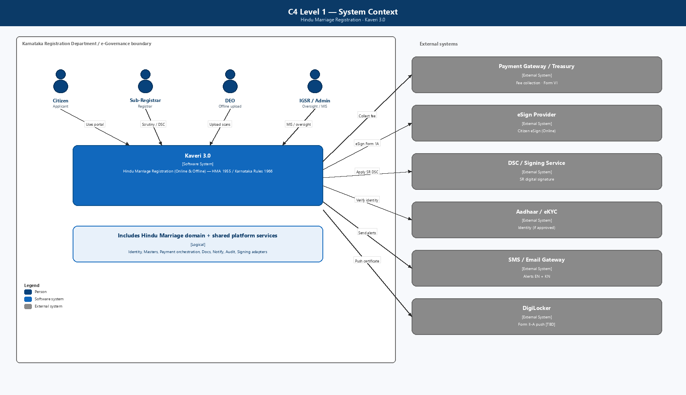
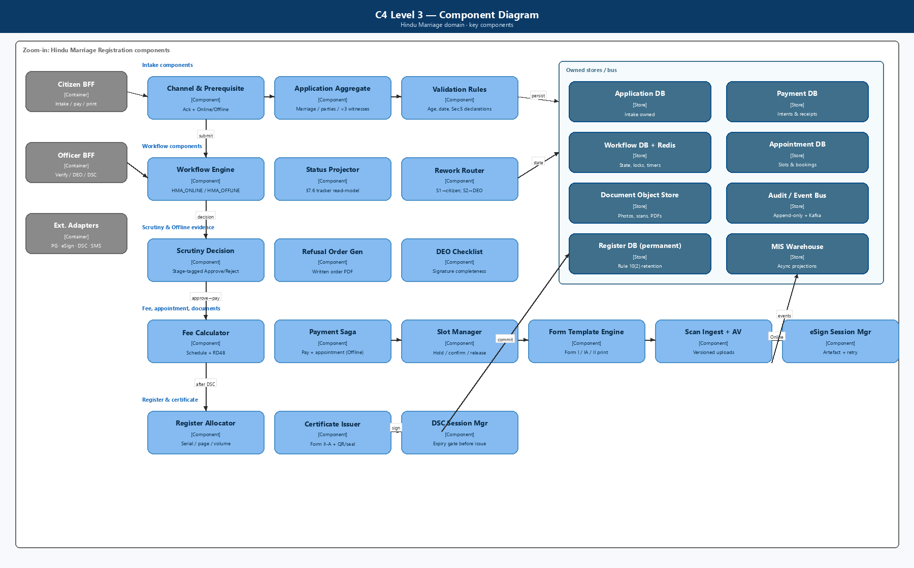

# High-Level Technical Design & Implementation Design

## Marriage Registration Module — Kaveri 3.0

| Field | Value |
|--------|--------|
| **Document ID** | HLD-K3-MRG-001 |
| **Version** | 1.0 (Draft) |
| **Status** | Draft for Architecture / PO review |
| **Module** | Marriage Registration (Hindu Marriage + Special Marriage) |
| **Source BRD** | `Finalized BRD/Marriage/RFP/BRD_Marriage_v1.9.docx` (BRD-K3-MRG-HMA-001 v1.9) |
| **Process sources** | `Process Diagrams/hindu marriage Online.png`, `hindu marriage Offline.png`; `Process Diagrams/Special Marriage/*` |
| **Architecture diagrams** | `HLD/ArchitectureDiagrams/C4_L1_System_Context.png`, `C4_L2_Containers.png`, `C4_L3_Components.png`, `C4_Deployment.png`, `C4_Channel_Workflow.png` |
| **Audience** | Solution Architect, Tech Leads, Integration, Security, DevOps, Product Owner |
| **Last updated** | 2026-08-27 |

---

## Document control

| Version | Date | Author | Summary |
|---------|------|--------|---------|
| 1.0 | 2026-08-27 | Architecture | HLD derived from finalized BRD v1.9 — Hindu Marriage Online/Offline + Special Marriage Notice + Registration; NFRs §15, risks §16, fallbacks §17 |

**Related documents**

| ID | Title |
|----|--------|
| BRD-K3-MRG-HMA-001 v1.9 | Business Requirements Document — Marriage Registration |
| PROC-K3-MRG-HMA-TOBE-001 | Process flows (HMA Online/Offline; SMA Notice/Registration) |
| HLD-K3-MRG-001 | This document |
| [TBD] | Platform / Kaveri 3.0 foundational HLD (shared services) |
| PO Architecture Evaluation Guide | Programme-wide architecture evaluation criteria |

---

## 1. Purpose and design goals

### 1.1 Purpose

Define the **high-level technical architecture** and **implementation design** for the Kaveri 3.0 Marriage Registration module covering:

1. **Hindu Marriage** — registration of already-solemnized marriages under **Section 8, HMA 1955** and **Registration of Hindu Marriage (Karnataka) Rules, 1966** (Online + Offline).
2. **Special Marriage — Notice Generation** — Intended Marriage (Chapter II) and Other Forms (Chapter III) under **SMA 1954** / **Special Marriage (Karnataka) Rules, 1961** (Online + Offline).
3. **Special Marriage — Marriage Registration** — solemnization / Chapter III registration after notice validity (In Person only).

### 1.2 Design goals

| Goal | How addressed |
|------|----------------|
| Correct legal path selection | Needs-Based Wizard (RS-MRG-001) — questions on solemnized vs intended and religion/custom; no raw Act picker |
| Statutory fidelity | Controlled templates for HMA Form I / IA / II / II-A and SMA Second–Fifth Schedules; Legal-locked wording |
| Dual channel where specified | Single application domain model with `servicePath` + `channel`; channel-specific workflow definitions |
| Payment hard gates | HMA: pay only after first SR approve; SMA: First Payment (notice) then Second Payment (registration) |
| Two-stage Offline HMA verification | Distinct Stage 1 / Stage 2; Stage 2 reject → DEO only |
| SMA statutory timeline | 30-day publication / objection clock; Intended ≥30 & ≤90 days; Other Forms ≥30 days |
| Role separation | Citizen / SR (Marriage Officer) / DEO–FDA–SDA / Admin; DEO cannot approve or DSC-sign |
| Resumable integrations | e-KYC / eSign / payment / SMS failures pause safely; no data loss (NFR-MRG-AVA-001, FB-MRG-*) |
| Audit & permanence | Immutable audit on critical transitions; registers / certificates retained permanently |
| Platform reuse | Shared Identity, Payment, Notification, Document, Master-Data, eSign/DSC adapters |
| Programme realism | Clear **target** service boundaries with **Phase-1 deployable** modular packages (see §5.4) |

### 1.3 Out of scope (this HLD)

- Parsee / Sikh marriage Acts
- Divorce / nullity court workflows (NULL/VOID endorsement capability flagged in BRD only)
- Detailed UI wireframes (BRD §10)
- Legacy migration ETL design (flagged only)
- Exact infra SKUs / SDC BOM (capacity worksheet TBD)

---

## 2. Architecture principles

1. **Domain-aligned services** — bounded contexts map to BRD capabilities (intake, notice, objection, verification, payment, register), not to UI screens.
2. **Workflow as a first-class concern** — channel- and path-aware state machines own transitions; domain services own data and rules.
3. **API-first + events** — synchronous APIs for user actions; domain events for notify, audit, MIS, DigiLocker, CRS/Kutumba fan-out.
4. **Shared platform services** — Identity, Payment, Document Store, Notification, Master Data, Signing adapters are platform-owned where possible.
5. **Jurisdiction-scoped tenancy** — SRO / DEO data access filtered by office.
6. **Security by design** — TLS 1.3, AES-256 at rest, secrets vault, PII masking, malware scan, VAPT gates (NFR-MRG-VAPT-*).
7. **Idempotency** — payment, eSign, DSC, appointment booking, notice publish, certificate issue must be safely retryable.
8. **Bilingual artefact pipeline** — EN/KN templates versioned; PDF rendering with Kannada font QA gate.
9. **Fail-safe external dependencies** — circuit breakers + resumable statuses; notifications never block certificate / notice issue (FB-MRG-004).

---

## 3. System context (C4 Level 1)



**Primary users**

| Persona | Channels / services | Primary surfaces |
|---------|---------------------|------------------|
| Citizen / parties | HMA Online/Offline; SMA Notice Online/Offline; SMA Registration | Needs wizard, application / notice wizard, tracker, payment, printout, certificate |
| Sub-Registrar / Marriage Officer | All | Verification queues, DEO allocation/reassignment, notice generation, objection enquiry, DSC |
| DEO / FDA / SDA | Offline HMA; Offline SMA Notice; SMA Registration | Signature checklist, photo capture, scan upload, declaration / certificate production |
| IGR / Admin | All | MIS, fee masters, office calendar, notice / registration reports |

**External systems (BRD §11):** Payment Gateway / Treasury, eSign Provider, DSC / Signing Service, Aadhaar e-KYC / Face Authentication, SMS / Email Gateway, DigiLocker (TBD), Kutumba portal, Civil Registration System, Labor Department (as approved), inter-office notice transmission (SMA Sec. 6(3)).

---

## 4. Container diagram (C4 Level 2)


**Presentation**

| Layer | Responsibility |
|-------|----------------|
| Citizen Portal | Needs-Based Wizard, HMA/SMA intake, eSign, pay, appointment, notice tracker, print, certificate download |
| SRO / Marriage Officer Workbench | Queues by service + stage, scrutiny, refusal orders, DEO allocate/reassign, notice generate, objection enquiry, DSC |
| DEO Console | Office-scoped tasks: signature check, photo, scan upload, declaration/certificate production |
| Admin / MIS | Fee masters, holidays, Form III / SMA books exports, channel-wise reports |

**BFFs** keep UIs thin, compose screens by `servicePath` + `channel`, and avoid chatty cross-service calls from browsers.

**Container summary**

| Tier | Containers |
|------|------------|
| Edge | WAF / API Gateway (TLS 1.3) |
| Experience | Citizen Portal, Officer Workbench, Admin / MIS UI |
| Aggregation | Citizen BFF, Officer BFF, Admin BFF |
| Domain | Service Routing / Wizard, Intake, Workflow, Notice & Objection, Verification, Payment, Document/Forms, Appointment, Register/Certificate, eSign/DSC adapters, MIS, Integration Gateway |
| Platform | Identity, Master Data, Notification, Audit, Event Bus, Object Store, Vault |
| Data | PostgreSQL (HA), Redis, Object Store |

---

## 4A. Component diagram (C4 Level 3)



Zoom-in on Marriage domain components implementing BRD hard gates: needs routing, channel fork, HMA pay-after-approve, Offline Stage 1/2, SMA first/second payment, 30-day countdown, objection enquiry, DSC-gated certificate issue.

---

## 5. Microservices architecture

### 5.1 Service catalogue (target)

| # | Service | Bounded context | Owns | Key BRD refs |
|---|---------|-----------------|------|--------------|
| 1 | **identity-access-service** *(platform)* | AuthN/AuthZ | Users, roles, sessions, MFA, jurisdiction claims | NFR-MRG-SEC/PRIV/AUD |
| 2 | **master-data-service** *(platform)* | Reference data | Districts, SRO offices, holidays, fee schedules (HMA + SMA), reason codes | FR-HMA-005/006; SMA fees |
| 3 | **service-routing-service** | Needs-Based Wizard | Questionnaire answers, resolved `servicePath`, audit of routing | RS-MRG-001; FR-HMA-001; FR-SMA-001/004/005 |
| 4 | **application-intake-service** | Application / notice capture | Application header, channel, declarations, HMA/SMA party data, drafts | §7.1–7.3; FR-HMA-*; FR-SMA-* |
| 5 | **workflow-orchestrator** | Process engine | Status models §7.1.2.4 / 7.2.2.4 / 7.3.2.3; transitions; SLA / countdown timers | BR-HMA-*; BR-SMA-*; FB-MRG-* |
| 6 | **document-form-service** | Documents & statutory forms | Uploads, photos, Form I/IA/II/II-A, SMA schedules, scan versions, AV + password-PDF block | FR-HMA-015–019, 065; FB-MRG-003 |
| 7 | **ekyc-adapter-service** | Aadhaar / Face Auth | e-KYC sessions; fallback to manual + docs (RS-MRG-002) | FR-HMA-058; FR-SMA-009/010 |
| 8 | **esign-adapter-service** | Citizen eSign | eSign sessions, signed artefacts, retry without re-entry | FR-HMA-056–057; FB-MRG-002 |
| 9 | **verification-service** | SR / Marriage Officer scrutiny | Stage-tagged decisions, reason codes, written refusal PDF | FR-HMA-070–077; SMA notice/visit verify |
| 10 | **deo-task-service** | Office operator tasks | Allocation, reassignment (FR-HMA-088), checklist, upload tasks | FR-HMA-063–069, 088; RS-MRG-003 |
| 11 | **payment-fee-service** | Fees & receipts | Fee calc, PG orchestration, poll-on-timeout, Form VI / SMA receipts, recon | FR-HMA-020–025; FR-SMA-049–053; FB-MRG-001 |
| 12 | **appointment-service** | Offline slots | Capacity, book/reschedule/cancel, no-show | HMA Offline; SMA Offline notice / registration visit |
| 13 | **notice-publication-service** | SMA notice book & publish | Marriage Notice Book entry, portal / board publication, Sec. 6(3) transmit, 30-day clock | FR-SMA-014–021, 029–032 |
| 14 | **objection-service** | Public objection & enquiry | Objection intake, summons workflow, uphold / dismiss outcomes | FR-SMA-022–028 |
| 15 | **register-certificate-service** | Legal register & certificates | HMA serial/page/volume + Form II-A; SMA Fourth/Fifth Schedule; QR/seal; DigiLocker push | FR-HMA-078–082; FR-SMA-033–041 |
| 16 | **dsc-signing-adapter** | SR DSC | DSC session, expiry check, signed PDF | FR-HMA-078–079; SMA DSC |
| 17 | **notification-service** *(platform)* | Alerts | SMS/email EN+KN; local queue + retry (FB-MRG-004) | FR-HMA-036–038; FR-SMA-054 |
| 18 | **audit-compliance-service** *(platform)* | Immutable audit | Append-only events for approvals, rejects, certificates, DEO allocations | NFR-MRG-AUD-001 |
| 19 | **mis-reporting-service** | Analytics | Channel MIS, aging, fee recon, Form III / SMA books exports | FR-HMA-039–045; FR-SMA-055–060 |
| 20 | **integration-gateway** *(façade)* | External I/O | Circuit breakers, idempotency keys, partner SLAs | §11; NFR-MRG-AVA-001 |

> **Sizing note:** Services 3–16 and 19 are Marriage-module–owned (or module-owned adapters). Platform services (1, 2, 17, 18) are shared across Kaveri 3.0.

### 5.2 Service responsibilities (selected detail)

#### service-routing-service

- Implements Needs-Based Wizard: solemnized vs intended; Hindu customary vs special / other forms.
- Emits immutable `ServicePathResolved` with citizen answers (audit / dispute evidence).
- Hands off to intake with `servicePath ∈ {HMA_REG, SMA_NOTICE_INTENDED, SMA_NOTICE_OTHER, SMA_REG}`.

#### application-intake-service

- Create/update drafts for HMA registration and SMA notice.
- Persist channel selection **before** combined prerequisite + declaration (BR-HMA-008/009).
- HMA validations: ages, marriage date ≤ today, exactly 3 witnesses, jurisdiction basis.
- SMA Other Forms branch: capture date / place / form of already celebrated ceremony at notice intake.
- Online HMA: office selection + summary before Form I & IA submit.
- Publish `ApplicationDetailsUpdated`, `ChannelSelected`, `DeclarationsAccepted`.

#### workflow-orchestrator

- Source of truth for statuses in BRD §7.1.2.4, §7.2.2.4, §7.3.2.3.
- Process definitions (illustrative): `HMA_ONLINE_v1`, `HMA_OFFLINE_v1`, `SMA_NOTICE_ONLINE_v1`, `SMA_NOTICE_OFFLINE_v1`, `SMA_REG_OFFLINE_v1`.
- Enforces hard gates (payment, eSign, Stage 2 → DEO, SMA timeline, objection branch).
- Owns countdown timers for SMA 30-day / 90-day windows; emits expiry events.
- Emits `ApplicationStatusChanged` for every transition.

#### notice-publication-service

- After First Payment (and Offline DEO notice-board path): generate statutory notice, enter Marriage Notice Book.
- Online: portal publication; Offline: board paste confirmation after DEO upload.
- Trigger inter-office transmission to Marriage Officer of permanent residence district (Sec. 6(3)).
- Start / pause / complete 30-day objection period clock.

#### objection-service

- Public objection intake against published notice.
- SR enquiry with summons; decide within statutory window.
- Outcomes: uphold → `Objected — closed` + portal removal; dismiss → continue toward registration eligibility.

#### payment-fee-service

- HMA: enabled only when status = `Approved for payment`.
- SMA: First Payment (notice fee) and Second Payment (registration / solemnization fee) as distinct intents.
- On gateway timeout: poll until terminal status; **lock UI against duplicate pay** (NFR-MRG-PAY-001 / FB-MRG-001).
- Offline HMA: coordinates with appointment as one guided step.
- Blocks certificate / notice-completion paths until reconciled where required.

#### deo-task-service

- Explicit SR allocate / reassign / recall without Helpdesk (FR-HMA-088, RS-MRG-003).
- Checklist gates before upload; versioned scan metadata in document-form-service.
- Supports HMA Offline Stage 2 path and SMA Offline notice / registration office tasks.

#### register-certificate-service

- HMA: on successful DSC allocate serial/page/volume atomically; Form II endorsement + Form II-A.
- SMA: Fourth Schedule (Intended) or Fifth Schedule (Other Forms) after solemnization / Chapter III registration + DSC.
- Delivery: portal download; Offline counter + download as applicable.
- Optional DigiLocker / CRS / Kutumba fan-out via events after issue.

### 5.3 Data ownership (database per service)

| Service | Primary store | Notes |
|---------|---------------|-------|
| service-routing | PostgreSQL | Wizard answers + resolved path |
| application-intake | PostgreSQL | Application / notice aggregate; party/witness children |
| workflow-orchestrator | PostgreSQL + Redis | Instance state, timers/locks |
| document-form | Object store + PostgreSQL metadata | Scans dominate Offline growth |
| notice-publication | PostgreSQL | Notice book, publication records, countdown |
| objection | PostgreSQL | Objections + enquiry decisions |
| verification | PostgreSQL | Decision history immutable |
| payment-fee | PostgreSQL | Intents, receipts, recon |
| appointment | PostgreSQL | Slots + bookings |
| deo-task | PostgreSQL | Allocation + task state |
| register-certificate | PostgreSQL | **Permanent** register / certificate |
| audit-compliance | Append-only / WORM | Separate from transactional DBs |
| mis-reporting | Read replica / warehouse | Async projections |

**No shared mutable DB** across services. Cross-service reads via APIs or event-fed read models.

### 5.4 Phase-1 deployable packaging (programme realism)

Target catalogue above is the **logical** design. For an 11-month delivery window, Phase 1 may deploy as **modular packages** with explicit boundaries (same APIs / events), then split:

| Deployable package | Contains (logical services) | Rationale |
|--------------------|----------------------------|-----------|
| **marriage-core** | routing + intake + workflow + verification + deo-task | Shared state machine & queues |
| **marriage-docs-sign** | document-form + esign + dsc + ekyc adapters | Heavy I/O & partner SDKs |
| **marriage-pay-appoint** | payment-fee + appointment | Saga / poll logic localized |
| **marriage-sma-notice** | notice-publication + objection | SMA-specific statutory clock |
| **marriage-register** | register-certificate | Highest durability / DR bar |
| **platform-\*** | identity, master, notify, audit | Shared across modules |

Independent deployability remains a **target**; do not block MVP on day-1 fine-grained runtime split.

---

## 6. Channel- and path-aware workflow design


### 6.0 Needs-Based Wizard (all citizens)

```text
START → Login → New Application → Marriage Registration
  → Needs-Based Wizard (solemnized? / intended? / religion-custom?)
  → servicePath resolved → Channel select (where applicable)
  → Combined Prerequisite + Declaration
```

### 6.1 Hindu Marriage — shared intake

```text
→ Details captured (Online: e-KYC / Face Auth on Bride per FR-HMA-058)
```

### 6.2 Hindu Marriage Online (`HMA_ONLINE_v1`)

```text
Details captured
  → Office selected & summary reviewed
  → Form I & Form IA submitted
  → eSign pending ──(complete)──► Pending SR verification
        │                              │
        │                              ├─ Reject ──► Rejected — data correction ──► Details captured
        │                              └─ Approve ─► Approved for payment
        │                                              → Payment completed
        │                                              → Pending SR digital signature
        │                                              → Registered → Certificate issued → Closed
        └─(retry; status stays eSign pending — FB-MRG-002)
```

### 6.3 Hindu Marriage Offline (`HMA_OFFLINE_v1`)

```text
Details captured
  → Pending SR verification (Stage 1)
        ├─ Reject ──► Rejected — data correction ──► Details captured
        └─ Approve ─► Approved for payment
                        → Payment completed + Appointment scheduled
                        → Forms printed
                        → Allocated to DEO (SR; reassignable — FR-HMA-088)
                        → Awaiting signed-form upload
                        → Signed forms uploaded (DEO)
                        → Pending SR verification — Stage 2
                              ├─ Reject ──► Rejected — upload ──► DEO only
                              └─ Approve ─► Pending SR digital signature
                                            → Registered → Certificate issued → Closed
```

### 6.4 Special Marriage Notice Online (`SMA_NOTICE_ONLINE_v1`)

```text
Details captured (+ Other Forms marriage details if applicable)
  → Notice application submitted (docs + photos)
  → Pending SR verification — notice
        ├─ Reject ──► Rejected — notice data
        └─ Approve ─► Notice approved
                        → First payment completed
                        → Notice generated → Notice published (portal)
                        → Citizen eSign on notice
                        → Objection period running (30 days)
                              ├─ Objection filed → Under objection enquiry → …
                              ├─ Notice expired → Closed (fresh notice)
                              └─ Notice valid for registration → (hand-off to §6.6)
```

### 6.5 Special Marriage Notice Offline (`SMA_NOTICE_OFFLINE_v1`)

```text
… (same through First payment)
  → Appointment scheduled
  → SR Generates Notice → Selects DEO
  → Photo / print / sign / scan / upload → Paste on notice board
  → Objection period running → … (same terminal outcomes as Online)
```

### 6.6 Special Marriage Registration (`SMA_REG_OFFLINE_v1`)

In Person only after `Notice valid for registration`:

```text
Select notice → Timeline gate
  (Intended: ≥30 & ≤90 days; Other Forms: ≥30 days)
  → If objection pending/open → enquiry branch
  → Second payment completed → Visit scheduled
  → Pending SR verification — visit
        ├─ Reject ──► Visit scheduled
        └─ Approve ─► Solemnized / Chapter III conditions met
                        → Allocated to DEO — certificate
                        → Joint photo → witnesses → declaration → certificate artefact
                        → Signed certificate uploaded
                        → Pending SR digital signature → Certificate issued → Closed
```

### 6.7 Transition enforcement matrix (examples)

| From | Event | Allowed if | Next |
|------|-------|------------|------|
| eSign pending | `EsignCompleted` | HMA Online; all required signatories done | Pending SR verification |
| Pending SR verification | `SrApproved` | HMA Online or Offline-S1 | Approved for payment |
| Pending SR verification — Stage 2 | `SrRejected` | HMA Offline | Rejected — upload (DEO) |
| Approved for payment | `PaymentInit` | Prior SR approve recorded | Intent created; status unchanged until success |
| Payment pending / timeout | `PaymentPoll` | FB-MRG-001 | Terminal success/fail; UI locked |
| Notice approved | `FirstPaymentSucceeded` | SMA notice | Notice generated |
| Objection period running | `Day30Elapsed` + no valid objection | Path rules | Notice valid for registration |
| Notice valid for registration | `SecondPaymentSucceeded` | Timeline gate OK | Visit scheduled |
| Pending SR digital signature | `DscCompleted` | Payment reconciled where required | Registered / Certificate issued |

---

## 7. Implementation design

### 7.1 Suggested technology baseline *(confirm with platform HLD)*

| Concern | Recommendation | Rationale |
|---------|----------------|-----------|
| Runtime | Java 17+ / Spring Boot **or** .NET 8 *(platform standard)* | Gov ecosystem, talent, long support |
| API style | REST + OpenAPI 3; async via events | BFF-friendly |
| Event bus | Kafka / managed equivalent | Audit, notify, MIS, CRS fan-out |
| Primary DB | PostgreSQL HA | Strong consistency for register & payments |
| Cache / locks | Redis | Appointment contention, payment locks, countdown |
| Object storage | S3-compatible (SDC) | DEO scans, photos, signed PDFs |
| Workflow | Camunda / Temporal / custom FSM | Targeted rework + statutory timers |
| PDF | Template service with Kannada fonts | Statutory exactness |
| API Gateway | Kong / APIM / SDC standard | WAF, mTLS, TLS 1.3 |
| Secrets | Vault / SDC secrets | NFR-MRG-SEC-001 |
| Observability | OpenTelemetry + Prometheus + ELK | Ops / hypercare |
| CI/CD | GitOps, env promotion, STQC / VAPT-ready builds | NFR-MRG-VAPT-* |

### 7.2 API surface (illustrative)

**Citizen (via Citizen BFF)**

| Method | Path | Purpose |
|--------|------|---------|
| POST | `/mrg/wizard/resolve` | Needs-Based Wizard → servicePath |
| POST | `/mrg/applications` | Start application / notice |
| POST | `/mrg/applications/{id}/channel` | Online \| Offline |
| POST | `/mrg/applications/{id}/prerequisite` | Combined ack |
| PUT | `/mrg/applications/{id}/details` | Parties / marriage / witnesses |
| POST | `/mrg/applications/{id}/ekyc/start` | e-KYC / Face Auth (or fallback) |
| POST | `/mrg/applications/{id}/office` | HMA Online office + summary |
| POST | `/mrg/applications/{id}/forms/submit` | Form I & IA / notice submit |
| POST | `/mrg/applications/{id}/esign/start` | Citizen eSign |
| POST | `/mrg/applications/{id}/payments/{purpose}` | `HMA_REG` \| `SMA_NOTICE` \| `SMA_REG` |
| POST | `/mrg/applications/{id}/appointment` | Offline slot |
| GET | `/mrg/applications/{id}/printouts` | Statutory PDFs |
| GET | `/mrg/notices/{id}` | Published notice / countdown |
| POST | `/mrg/notices/{id}/objections` | Public objection (authenticated policy TBD) |
| POST | `/mrg/registrations/from-notice/{noticeId}` | Start SMA registration |
| GET | `/mrg/applications/{id}/certificate` | Certificate download |
| GET | `/mrg/applications/{id}/tracker` | Path-specific progress |

**SR / DEO (via Officer BFF)**

| Method | Path | Purpose |
|--------|------|---------|
| GET | `/mrg/queues?service=&stage=` | HMA / SMA notice / visit queues |
| POST | `/mrg/applications/{id}/verifications` | Approve/Reject + reason |
| POST | `/mrg/applications/{id}/deo/allocate` | Allocate / reassign / recall |
| POST | `/mrg/applications/{id}/deo/checklist` | Signature completeness |
| POST | `/mrg/applications/{id}/deo/uploads` | Scan upload (versioned) |
| POST | `/mrg/notices/{id}/generate` | SR notice generation (Offline) |
| POST | `/mrg/objections/{id}/enquiry` | Enquiry decision |
| POST | `/mrg/applications/{id}/dsc/sign` | SR digital signature |
| POST | `/mrg/applications/{id}/refusal-order` | Written order artefact |

All mutating APIs require: auth token, idempotency-key, office-scope check, and workflow permission for current status.

### 7.3 Domain events (minimum set)

| Event | Producers | Consumers |
|-------|-----------|-----------|
| `ServicePathResolved` | Routing | Intake, Workflow, Audit, MIS |
| `ChannelSelected` | Intake | Workflow, Audit, MIS |
| `EsignCompleted` / `EsignFailed` | eSign adapter | Workflow, Audit, Document |
| `VerificationDecisionRecorded` | Verification | Workflow, Notify, Audit, MIS |
| `DeoAllocated` / `DeoReassigned` | DEO task | Workflow, Notify, Audit |
| `PaymentSucceeded` / `PaymentFailed` | Payment | Workflow, Notify, Audit, MIS |
| `AppointmentBooked` | Appointment | Workflow, Notify, Audit |
| `NoticePublished` | Notice | Objection clock, Notify, Audit, MIS |
| `ObjectionFiled` / `ObjectionResolved` | Objection | Workflow, Notice, Notify, Audit |
| `NoticeValidityChanged` | Workflow / Notice | Citizen tracker, Audit |
| `CertificateIssued` | Register-Cert | Notify, DigiLocker/CRS, Audit, MIS |
| `ApplicationStatusChanged` | Workflow | Audit, Tracker read-model, MIS |

### 7.4 Key sequence — HMA Online (happy path)

```text
Citizen → Wizard → Intake (details + e-KYC)
Citizen → Office + Form I/IA → eSign → Workflow (Pending SR)
SR → Verification (Approve) → Workflow (Approved for payment)
Citizen → Payment → PG callback/poll → Workflow (Payment completed)
SR → DSC → Register-Cert (serial + Form II-A)
       → Workflow (Certificate issued) → Notification + Audit + MIS
```

### 7.5 Key sequence — HMA Offline (happy path)

```text
Citizen → Intake → Workflow (Pending SR Stage 1)
SR → Approve → Citizen Payment + Appointment
Citizen → Print → SR Allocate DEO → Physical sign/visit
DEO → Checklist + upload → SR Stage 2 Approve → DSC → Certificate
```

### 7.6 Key sequence — SMA Notice → Registration

```text
Citizen → Wizard (Intended / Other Forms) → Notice intake + docs
SR → Approve notice → First Payment → Notice generate/publish → 30-day clock
[optional Objection → Enquiry]
Citizen (when valid) → Second Payment → Visit → SR verify
DEO → Joint photo / witnesses / declaration / certificate artefact
SR → DSC → Certificate (Fourth or Fifth Schedule) issued
```

### 7.7 Payment resilience saga

1. Create payment intent with idempotency key and `purpose`.
2. Redirect / initiate PG; on timeout **poll** until terminal (FB-MRG-001).
3. UI pay action disabled while status ∈ {Initiated, Pending, Polling}.
4. On success: emit `PaymentSucceeded`; advance workflow.
5. On failure: remain on payable status; allow single new intent after terminal fail.
6. Offline HMA: soft-hold appointment; confirm on pay success; release on fail/timeout compensation.

### 7.8 Register / certificate allocation

- HMA per-office sequence: `(officeId, registerVolume, page, serial)` under row lock + transactional outbox.
- Never allocate before DSC success and required payment reconciliation.
- SMA certificate schedule selection driven by `servicePath` (Fourth vs Fifth Schedule).
- PDF generation async after commit; status flips when artefact ready.

### 7.9 Deployment view (C4)


**Environments:** Dev → SIT → UAT → Pre-Prod → Prod (+ isolated DR). Non-prod uses anonymized data.

### 7.10 Implementation phases (suggested)

| Phase | Scope | Exit criteria |
|-------|-------|---------------|
| **P0 — Platform spine** | Identity, Gateway, Masters, Audit, Notify, Doc store | Shared contracts published |
| **P1 — Routing + HMA Online MVP** | Wizard, HMA Online end-to-end (e-KYC, eSign, pay-after-approve, DSC, II-A) | HMA Online UAT |
| **P2 — HMA Offline MVP** | Stage 1/2, pay+appointment, printouts, DEO allocate/reassign, upload | HMA Offline UAT |
| **P3 — SMA Notice** | Online + Offline notice, First Payment, publication, 30-day clock, objections | Notice UAT + timeline tests |
| **P4 — SMA Registration** | Second Payment, visit, solemnization/Chapter III, Fourth/Fifth Schedule | Full SMA UAT |
| **P5 — MIS, integrations, hardening** | Channel MIS, Form III / books, DigiLocker/CRS/Kutumba, surge 3×, VAPT | Go-live gate |

---

## 8. Security, privacy, and compliance design

| Control | Design |
|---------|--------|
| AuthN | Citizen portal IdP; Officer SSO; MFA for SR/Admin (TBD) |
| AuthZ | RBAC: `CITIZEN`, `SR`, `DEO`, `IGSR_ADMIN`; jurisdiction claim on officer tokens |
| DEO separation | Checklist / photo / upload / declaration production only; deny approve/register/DSC |
| Encryption | TLS 1.3 in transit; AES-256 at rest (NFR-MRG-SEC-001) |
| PII | Mask Aadhaar / biometrics in logs and unauthorized views (NFR-MRG-PRIV-001) |
| Uploads | AV scan; reject password-protected PDFs / invalid types (FB-MRG-003) |
| eSign / DSC | Tamper-evident artefacts; retry without re-entry (FB-MRG-002) |
| Certificate | QR / digital seal verification endpoint (public, minimal PII) |
| Secrets | Vault; no secrets in images/git |
| VAPT | Pre-prod comprehensive VAPT; zero open Critical/High; annual + change-triggered (NFR-MRG-VAPT-001–004) |
| Compliance | GIGW, WCAG 2.x, MeitY/CERT-In, STQC path, UIDAI if eKYC used |

---

## 9. NFR → architecture mapping

| NFR (BRD §15) | Architecture response |
|---------------|----------------------|
| NFR-MRG-PERF-001 | BFF aggregation, cached masters, async PDF; p95 UI ≤2s, external API ≤5s |
| NFR-MRG-PERF-002 | Stateless pods; HPA; load test 5k citizen + 2.5k officer sessions |
| NFR-MRG-SCALE-001 | Autoscaling runbook; surge test at 3× baseline (auspicious dates) |
| NFR-MRG-SEC-001 | TLS 1.3 + AES-256; gateway WAF |
| NFR-MRG-PRIV-001 | Field classification; masked logs; least-privilege DB views |
| NFR-MRG-AUD-001 | Every critical transition + DEO allocate → audit-compliance-service |
| NFR-MRG-AVA-001 | Circuit breakers; resumable statuses; bilingual error UX |
| NFR-MRG-PAY-001 | Payment poll + UI lock; idempotent intents |
| NFR-MRG-VAPT-* | Security gate in release checklist; retest Critical/High |

---

## 10. Integration design

| Integration | Pattern | Resilience |
|-------------|---------|------------|
| Payment gateway / Treasury | Sync initiate + async callback + **poll on timeout** | Idempotent; UI lock; circuit breaker |
| eSign provider | Redirect/SDK + callback | Retry; remain `eSign pending` |
| DSC / signing | Officer-initiated; tokenized session | Block issue if DSC expired |
| Aadhaar e-KYC / Face Auth | Adapter; fallback to manual + mandatory docs | UIDAI-compliant logging; RS-MRG-002 |
| DigiLocker | Optional fetch / certificate push | Best-effort after issue |
| SMS / Email | Async via notification-service | Local queue + retry; never block critical path |
| Master data | Sync pull + cache TTL | Office/holiday invalidation |
| Notice publication (portal) | Internal module API | Idempotent publish |
| Objection intake | Public/authenticated API | Rate limit + audit |
| Inter-office notice transmit | Async outbound | Retry with DLQ |
| Kutumba / CRS / Labor | Event-driven outbound (as approved) | Best-effort; compensating reconcile |

---

## 11. Logical data model (core)

```text
ServiceRoutingDecision
  id, answersJson, servicePath, decidedAt, citizenId

Application
  id, servicePath, channel{ONLINE|OFFLINE|N/A}, status, officeId,
  jurisdictionBasis, prerequisiteAckAt, noticeId?, createdBy, versions...

MarriageEvent
  applicationId, marriageDate, place, ceremonyDescription  # HMA; SMA Other Forms

Party (Bride | Bridegroom)
  name, parents, dob/age, residence, address, maritalStatus, ekycRef?

Witness
  name, relation, age, residence, address  # HMA ×3 at intake; SMA ×3 at registration

MarriageNotice
  id, applicationId, path{INTENDED|OTHER_FORMS}, noticeBookEntryNo,
  publishedAt, channelPublication{PORTAL|BOARD}, countdownEndsAt, validFrom, validTo?

Objection
  noticeId, objector, grounds, filedAt, enquiryStatus, decision, decidedAt

DocumentAsset
  applicationId, type, version, storageUri, checksum, uploadedByRole

VerificationDecision
  applicationId, stage, decision, reasonCode, actorId, at

Payment
  applicationId, purpose{HMA_REG|SMA_NOTICE|SMA_REG}, amount, status, receiptNo, pgRef

Appointment
  applicationId, officeId, slotStart, slotEnd, status

DeoAllocation
  applicationId, deoUserId, allocatedBy, allocatedAt, active

RegisterEntry
  applicationId, officeId, serialNo, pageNo, volumeNo, registeredAt  # HMA

Certificate
  applicationId, formType{II_A|FOURTH_SCHEDULE|FIFTH_SCHEDULE},
  issuedAt, integrityToken, deliveryMode
```

Retention: **RegisterEntry + Certificate + Notice Book + Memorandum artefacts = permanent**; operational drafts/logs per policy.

---

## 12. Observability and operations

| Signal | Examples |
|--------|----------|
| SLIs | Wizard→path success, submit p95, eSign success, pay success (no double-debit), Stage aging, notice countdown accuracy, cert issue latency |
| Alerts | PG poll lag, eSign/DSC errors, e-KYC outage fallback rate, upload AV/password rejects, queue backlog, notice expiry surge |
| Runbooks | Payment stuck, eSign abandon, DEO reassignment, objection enquiry SLA, DR failover, Form III / books rerun |
| Support | L1 portal; L2 workflow/payment/notice clock; L3 domain + infra; **90-day hypercare** (BRD §18.4) |

---

## 13. Risks, fallbacks, and open architecture decisions

### 13.1 BRD risks (mandatory mitigations)

| ID | Mitigation in architecture |
|----|----------------------------|
| RS-MRG-001 | `service-routing-service` Needs-Based Wizard; no Act-code landing |
| RS-MRG-002 | Resumable workflow + e-KYC fallback to manual+docs; payment/eSign FB-MRG-* |
| RS-MRG-003 | `deo-task-service` allocate/reassign/recall APIs; audited |

### 13.2 Fallbacks (FB-MRG)

| ID | Design hook |
|----|-------------|
| FB-MRG-001 | Payment poller + UI lock in payment-fee-service |
| FB-MRG-002 | Persist `eSign pending` / `Pending SR digital signature`; retry signing only |
| FB-MRG-003 | Pre-persist validators in document-form-service (password PDF / MIME) |
| FB-MRG-004 | Notification outbox; workflow continues on SMS/email failure |

### 13.3 Open decisions

| ID | Topic | Impact | Owner |
|----|-------|--------|-------|
| AD-01 | Workflow engine (Camunda / Temporal / custom) | Timers & SMA countdown | Arch |
| AD-02 | Platform language/runtime standard | Service templates | Platform Arch |
| AD-03 | Shared vs module-owned payment service | Reuse across Kaveri | Platform Arch |
| AD-04 | Phase-1 modular packages vs fine-grained deploy | Delivery risk | PO / Arch |
| AD-05 | Public objection authentication model | Abuse / spam controls | PO / Legal |
| AD-06 | DigiLocker / CRS / Kutumba / Labor go-live scope | Integration backlog | PO |
| AD-07 | Who must eSign on HMA Online (parties vs +witnesses) | eSign UX | Legal / DE |
| AD-08 | RPO/RTO for register DB + object store | DR topology | Arch / SDC |

---

## 14. Traceability summary (BRD → services)

| BRD capability | Primary services |
|----------------|------------------|
| Needs-Based Wizard / module entry | Routing, Intake, Audit |
| HMA data capture Form I/IA | Intake, Document-Form, eKYC |
| HMA Online eSign | eSign, Document-Form, Workflow |
| HMA Offline Stage 1 / 2 | Verification, DEO-Task, Workflow |
| HMA pay after approve | Payment-Fee, Workflow |
| Appointment | Appointment, Payment-Fee, Workflow |
| SMA Notice generate / publish / 30-day | Notice-Publication, Workflow, Payment |
| SMA Objection | Objection, Notice, Verification |
| SMA Registration / schedules | Intake, DEO-Task, Register-Certificate, DSC |
| MIS / Form III / books | MIS-Reporting |
| Notifications | Notification (queued) |
| NFRs §15 / Fallbacks §17 | Gateway, Payment, Audit, Observability, Security |

---

## 15. Acceptance criteria for this HLD

Architecture review is complete when:

1. Service boundaries (logical) and Phase-1 packaging are agreed.
2. HMA Online/Offline and SMA Notice/Registration state machines are signed off against BRD process diagrams.
3. Needs-Based Wizard routing matrix is approved by Domain Expert / PO.
4. Integration adapter list and ownership (module vs platform) are confirmed.
5. Security role matrix (Citizen / SR / DEO / Admin) is approved.
6. NFR and fallback controls have owners and test evidence plans.
7. P0–P5 delivery phasing is accepted by PO.

---

## Appendix A — Glossary (architecture)

| Term | Meaning |
|------|---------|
| BFF | Backend-for-Frontend aggregation API for a UI surface |
| Hard gate | Workflow rule that blocks an action until precondition is true |
| servicePath | Resolved legal/service route from Needs-Based Wizard |
| Targeted rework | Return to a specific prior step (not generic resubmit) |
| Register cursor | Per-office counter for serial/page/volume allocation |
| Saga | Multi-service transaction with compensations (pay + appointment) |
| First / Second Payment | SMA notice fee vs registration/solemnization fee |

## Appendix B — Reference inputs

- BRD-K3-MRG-HMA-001 v1.9 — Business requirements (functional + NFR §15 + risks §16 + fallbacks §17 + training §18)
- Process diagrams — HMA Online/Offline; SMA Notice Online/Offline; SMA Registration Intended/Other Forms
- HMA 1955; Karnataka Rules 1966; SMA 1954; Special Marriage (Karnataka) Rules 1961
- Prior HLD draft for HMA-only (`HLD_Implementation_Design_Hindu_Marriage_HMA_1955.md`) — superseded for scope by this document

## Appendix C — C4 diagram catalogue

| Diagram | File | Section |
|---------|------|---------|
| System Context (L1) | `ArchitectureDiagrams/C4_L1_System_Context.png` | §3 |
| Containers (L2) | `ArchitectureDiagrams/C4_L2_Containers.png` | §4 |
| Components (L3) | `ArchitectureDiagrams/C4_L3_Components.png` | §4A |
| Channel Workflow | `ArchitectureDiagrams/C4_Channel_Workflow.png` | §6 |
| Deployment | `ArchitectureDiagrams/C4_Deployment.png` | §7.9 |

> Diagrams currently reflect the Hindu Marriage baseline container model; SMA notice/objection containers are specified in §§4–5 and should be refreshed in the next diagram iteration.

## Appendix D — Process diagram catalogue (BRD)

| Flow | Location |
|------|----------|
| Hindu Marriage Online | `Finalized BRD/Marriage/RFP/Process Diagrams/hindu marriage Online.png` |
| Hindu Marriage Offline | `Finalized BRD/Marriage/RFP/Process Diagrams/hindu marriage Offline.png` |
| SMA Notice Online | `.../Special Marriage/*NoticeOnline*.png` |
| SMA Notice Offline | `.../Special Marriage/*NoticeOffline*.png` |
| SMA Registration Intended | `.../Special Marriage/*Registration_IntendedMarriage*.png` |
| SMA Registration Other Forms | `.../Special Marriage/*Registration_Others*.png` |

---

*End of HLD / Implementation Design v1.0 — derived from BRD_Marriage_v1.9; resolve AD-* items through Architecture & Domain Expert workshops.*
