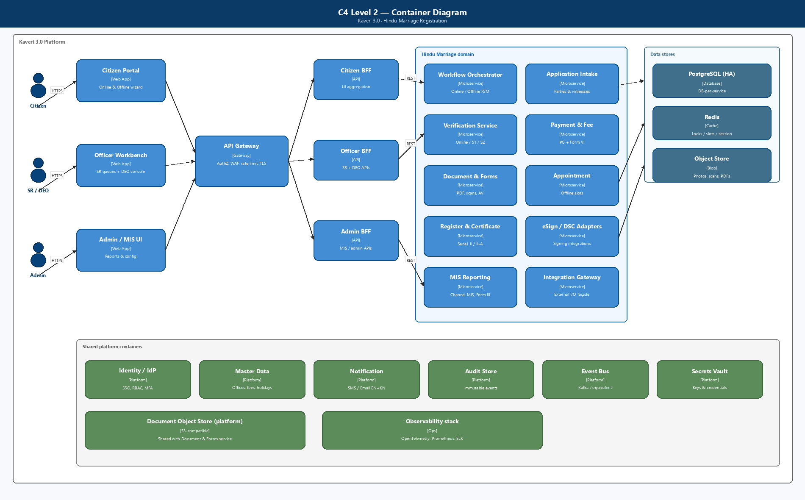
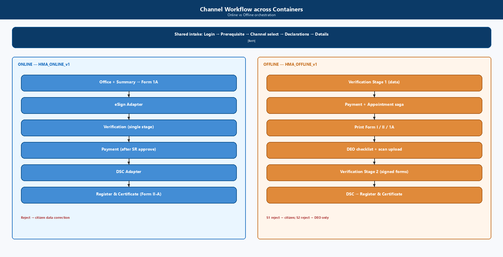
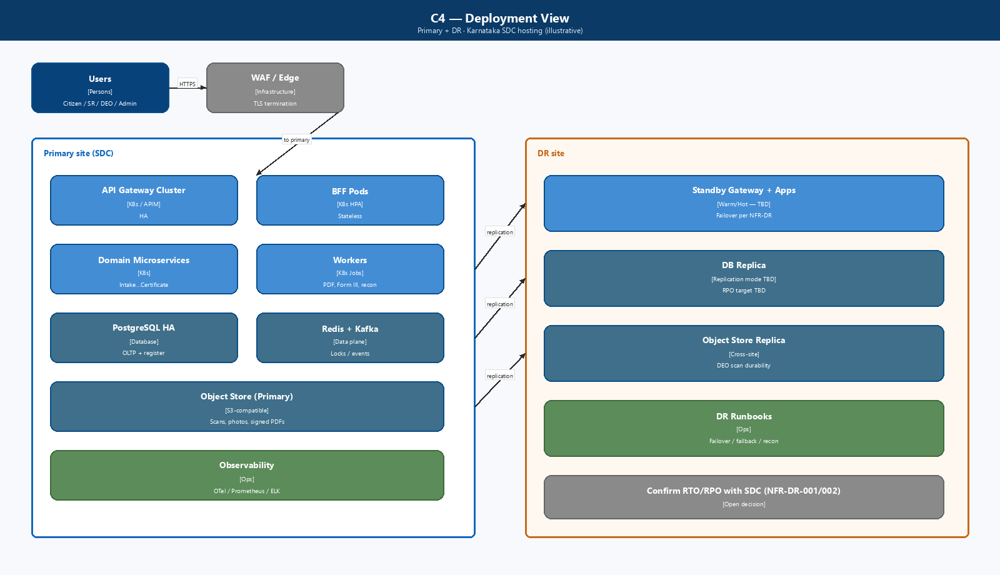

# High-Level Technical Design & Implementation Design

## Marriage Registration Module — Hindu Marriage (Kaveri 3.0)

| Field | Value |
|--------|--------|
| **Document ID** | HLD-K3-MRG-HMA-001 |
| **Version** | 0.2 (Draft) |
| **Status** | Draft for Architecture review |
| **Module** | Marriage Registration — Hindu Marriage Act, 1955 |
| **Source BRD** | `BRD_Template_Marriage_Hindu_Marriage_Act_1955.md` / `.docx` (BRD-K3-MRG-HMA-001) |
| **Process source** | `ProcessDiagrams/Hindu_Marriage_Online.png`, `ProcessDiagrams/Hindu_Marriage_Offline.png` |
| **Architecture diagrams** | `ArchitectureDiagrams/C4_L1_System_Context.png`, `C4_L2_Containers.png`, `C4_L3_Components.png`, `C4_Deployment.png`, `C4_Channel_Workflow.png` |
| **Related context** | [NFR expansion session](bf5086ab-d69f-4747-b8f3-af1e96d35075) — Availability, Performance, Security, Privacy, Audit, DR, Ops, Capacity, Compliance |
| **Audience** | Solution Architect, Tech Leads, Integration, Security, DevOps, PO |
| **Last updated** | 2026-08-13 |

---

## Document control

| Version | Date | Author | Summary |
|---------|------|--------|---------|
| 0.1 | 2026-08-13 | Architecture | Initial HLD + microservices implementation design derived from BRD v0.3 To-Be |
| 0.2 | 2026-08-13 | Architecture | Added C4 Level 1–3, Deployment, and Channel Workflow diagrams |

**Related documents**

| ID | Title |
|----|--------|
| BRD-K3-MRG-HMA-001 | Business Requirements Document |
| PROC-K3-MRG-HMA-TOBE-001 | Online / Offline process diagrams |
| HLD-K3-MRG-HMA-001 | This document |
| [TBD] | Platform / Kaveri 3.0 foundational HLD (shared services) |

---

## 1. Purpose and design goals

### 1.1 Purpose

Define the **high-level technical architecture** and **microservices implementation design** for registering already-solemnized Hindu marriages under **Section 8, HMA 1955** and **Registration of Hindu Marriage (Karnataka) Rules, 1966**, as specified in the BRD.

### 1.2 Design goals

| Goal | How addressed |
|------|----------------|
| Statutory fidelity | Form I / IA / II / II-A / III / VI generated from controlled templates; no wording change without Legal |
| Dual channel (Online / Offline) | Single application domain model with `channel` attribute; channel-specific workflow definitions |
| Payment after SR approval | Workflow hard-gate; Payment Service disabled until *Approved for payment* |
| Two-stage Offline verification | Distinct workflow stages + audit; Stage 2 reject → DEO, not citizen |
| Role separation | Citizen / SR / DEO / Admin RBAC; DEO cannot approve or DSC-sign |
| Audit & permanence | Immutable audit events; register entries retained per Rule 10(2) |
| Platform reuse | Shared Identity, Payment, Notification, Document, Master-Data, eSign/DSC adapters |
| Scale for e-Gov | Stateless services, async integrations, horizontal scale; align to ≥10k concurrent platform bar |

### 1.3 Out of scope (this HLD)

- Special Marriage Act and other personal-law Acts
- Divorce / nullity court workflows
- Detailed UI wireframes (see BRD §11)
- Legacy migration ETL design (flagged only)
- Exact infra SKUs / SDC BOM (capacity worksheet TBD)

---

## 2. Architecture principles

1. **Domain-aligned microservices** — bounded contexts map to BRD capabilities, not to UI screens.
2. **Workflow as a first-class service** — channel-aware state machine owns transitions; domain services own data and rules.
3. **API-first + events** — synchronous APIs for user actions; domain events for side effects (notify, audit, MIS, DigiLocker).
4. **Shared platform services** — Identity, Payment, Document Store, Notification, Master Data, Signing adapters are platform-owned where possible.
5. **Jurisdiction-scoped tenancy** — SRO / DEO data access filtered by office (FR-HMA-170, NFR-HMA-SEC-002).
6. **Security by design** — TLS, secrets vault, PII masking, malware scan on uploads, UIDAI-compliant Aadhaar handling.
7. **Idempotency** — payment, eSign, DSC, appointment booking, certificate issue must be safely retryable.
8. **Bilingual artefact pipeline** — EN/KN templates versioned; PDF rendering with Kannada font QA gate.

---

## 3. System context (C4 Level 1)


**Primary users**

| Persona | Channels | Primary surfaces |
|---------|----------|------------------|
| Citizen | Online + Offline | Portal application wizard, tracker, payment, printout, certificate download |
| Sub-Registrar (SR) | Both | Verification queues (Online / Offline S1 / Offline S2), DSC, refusal orders |
| Data Entry Operator | Offline only | Signature checklist + scan upload |
| IGSR / Admin | Both | MIS, config, Form III export |

**External systems:** Payment Gateway / Treasury, eSign Provider, DSC / Signing Service, Aadhaar / eKYC (if approved), SMS / Email Gateway, DigiLocker (TBD).

---

## 4. Container diagram (C4 Level 2)



**Presentation**

| Layer | Responsibility |
|-------|----------------|
| Citizen Portal | Prerequisite, channel select, data capture, eSign, pay, appointment, print, tracker |
| SRO Workbench | Queues by stage, scrutiny, written refusal, DSC, register/serial |
| DEO Console | Office-scoped lookup, signature checklist, upload/re-upload |
| Admin / MIS | Fee masters, office calendar, Form III, channel-wise reports |

**BFFs** keep UIs thin, enforce channel-specific screen composition (FR-HMA-143), and avoid chatty cross-service calls from browsers.

**Container summary**

| Tier | Containers |
|------|------------|
| Edge | WAF / API Gateway |
| Experience | Citizen Portal, Officer Workbench, Admin / MIS UI |
| Aggregation | Citizen BFF, Officer BFF, Admin BFF |
| Domain | Workflow, Intake, Verification, Payment, Document/Forms, Appointment, Register/Certificate, eSign/DSC adapters, MIS, Integration Gateway |
| Platform | Identity, Master Data, Notification, Audit, Event Bus, Object Store, Vault |
| Data | PostgreSQL (HA), Redis, Object Store |

---

## 4A. Component diagram (C4 Level 3)


Zoom-in on the Hindu Marriage domain showing components that implement BRD hard gates: channel fork, targeted rework, pay-after-approve saga, DEO checklist, register allocation, and DSC-gated certificate issue.

---

## 5. Microservices architecture

### 5.1 Service catalogue

| # | Service | Bounded context | Owns | Key BRD refs |
|---|---------|-----------------|------|--------------|
| 1 | **identity-access-service** *(platform)* | AuthN/AuthZ | Users, roles, sessions, MFA, jurisdiction claims | NFR-SEC-001/002, SEC-011 |
| 2 | **master-data-service** *(platform)* | Reference data | Districts, SRO offices, holidays, fee schedule, reason codes | FR-010/011, FR-090 |
| 3 | **application-intake-service** | Application capture | Application header, channel, declarations, marriage/party/witness data, drafts | §7.2, FR-001–072, FR-140–145 |
| 4 | **workflow-orchestrator** | Process engine | Status model §7.6, transitions, targeted rework, SLA timers | FR-200, BR-010–019 |
| 5 | **document-form-service** | Documents & statutory forms | Uploads, joint photo, Form I/IA/II print PDFs, scan versions, AV scan hook | FR-080–082, FR-162–168 |
| 6 | **esign-adapter-service** | Citizen eSign | eSign sessions, signed artefacts, retry | FR-153–156, NFR-PERF-006 |
| 7 | **verification-service** | SR scrutiny | Stage-tagged decisions, reason codes, written refusal PDF | FR-180–188 |
| 8 | **payment-fee-service** | Fees & receipts | Fee calculation, PG orchestration, Form VI receipt, reconciliation | FR-090–096, BR-012 |
| 9 | **appointment-service** | Offline slots | Capacity, book/reschedule/cancel, no-show | FR-160–161, NFR-PERF-009 |
| 10 | **register-certificate-service** | Legal register | Serial/page/volume, Form II endorsement, Form II-A, QR/seal, DigiLocker push | FR-103–104, FR-190–194 |
| 11 | **dsc-signing-adapter** | SR DSC | DSC session, expiry check, signed PDF | FR-190–191, NFR-SEC-010 |
| 12 | **notification-service** *(platform)* | Alerts | SMS/email EN+KN templates | FR-120–121, FR-202 |
| 13 | **audit-compliance-service** *(platform)* | Immutable audit | Append-only events, export for AG/security | NFR-AUD-001–010 |
| 14 | **mis-reporting-service** | Analytics | Channel MIS, aging, fee recon, Form III batch | FR-130–136 |
| 15 | **integration-gateway** *(optional façade)* | External I/O | Circuit breakers, idempotency keys, partner SLAs | §12 |

> **Sizing note:** Services 3–11 are Marriage-module–owned. Platform services (1, 2, 12, 13) are shared across Kaveri 3.0; Marriage consumes them via contracts.

### 5.2 Service responsibilities (detail)

#### application-intake-service

- Create/update draft applications.
- Persist prerequisite acknowledgement & channel selection (audited).
- Validate Section 5(iii) ages, marriage date ≤ today, exactly 3 witnesses.
- Jurisdiction basis capture (place of marriage **or** ordinary residence).
- Online: office selection + summary review gate before Form 1A submit.
- Publish `ApplicationDetailsUpdated`, `ChannelSelected`, `DeclarationsAccepted`.

#### workflow-orchestrator

- Source of truth for **status** (BRD §7.6).
- Separate process definitions: `HMA_ONLINE_v1`, `HMA_OFFLINE_v1`.
- Enforces hard gates: eSign complete → SR verify (Online); payment only after first SR approve; print only after payment+appointment; Stage 2 reject → DEO.
- Emits `ApplicationStatusChanged` for every transition (FR-HMA-203).

#### document-form-service

- Object storage for photos, proofs, DEO scans (versioned).
- Template engine for Form I, IA, II (pre-endorsement print — see OQ-006), II-A.
- Duplicate memorandum support (original + duplicate).
- Barcode/QR on offline printout for DEO retrieval.
- Malware scan before persist (NFR-SEC-012).

#### verification-service

- Work queues filtered by office + stage: Online | Offline-S1 | Offline-S2.
- Decision records: actor, timestamp, stage, decision, reason code + free text.
- Generates written refusal order PDF; notifies parties.
- Does **not** assign register serial (that is register-certificate-service after DSC).

#### payment-fee-service

- Fee from master schedule + notifications (RD48 etc.).
- Enabled only when workflow status = `Approved for payment`.
- Offline: coordinates with appointment-service as **one guided step** (FR-HMA-094).
- Idempotent PG callbacks; retry without reopening SR verification (FR-HMA-096).
- Blocks certificate path until reconciled (FR-HMA-095).

#### appointment-service

- Slot calendar per SRO office (holiday-aware via master-data).
- Optimistic locking / unique booking to prevent double-book (NFR-PERF-009).
- Reschedule/cancel/no-show events (rules TBD OQ-007).

#### register-certificate-service

- On successful DSC: allocate serial/page/volume atomically per office register book.
- Generate Form II endorsement + Form II-A with integrity QR/seal.
- Delivery mode: portal download (Online); counter + download (Offline).
- Monthly Form III duplicate bundle job for Registrar-General.

### 5.3 Data ownership (database per service)

| Service | Primary store | Notes |
|---------|---------------|-------|
| application-intake | PostgreSQL | Application aggregate; party/witness child tables |
| workflow-orchestrator | PostgreSQL + optional Redis | Instance state, timers; Redis for locks/SLA |
| document-form | Object store (S3-compatible) + PostgreSQL metadata | Scans dominate Offline storage growth (NFR-OP-11) |
| verification | PostgreSQL | Decision history immutable |
| payment-fee | PostgreSQL | Payment intents, receipts, recon |
| appointment | PostgreSQL | Slots + bookings |
| register-certificate | PostgreSQL | **Permanent** register; strict backup/DR |
| audit-compliance | Append-only store (WORM / immutable table) | Separate from transactional DBs |
| mis-reporting | Read replica / warehouse | Async projection from events |

**No shared mutable DB** across services. Cross-service reads via APIs or read models fed by events.

---

## 6. Channel-aware workflow design



### 6.1 Shared intake (both channels)

```text
START → Login → New Application → Marriage Registration
  → Prerequisite acknowledged → ChannelSelected(Online|Offline)
  → Declarations accepted → Details captured
```

### 6.2 Online process definition (`HMA_ONLINE_v1`)

```text
Details captured
  → Office selected & summary reviewed
  → Form 1A submitted
  → eSign pending ──(complete)──► Pending SR verification
        │                              │
        │                              ├─ Reject ──► Rejected — data correction ──► Details captured
        │                              └─ Approve ─► Approved for payment
        │                                              → Payment completed
        │                                              → Pending SR digital signature
        │                                              → Registered → Certificate issued → Closed
        └─(retry on failure; status stays eSign pending)
```

### 6.3 Offline process definition (`HMA_OFFLINE_v1`)

```text
Details captured
  → Pending SR verification (Stage 1)
        ├─ Reject ──► Rejected — data correction ──► Details captured
        └─ Approve ─► Approved for payment
                        → Payment completed + Appointment scheduled (atomic guided step)
                        → Forms printed
                        → Awaiting signed-form upload
                        → Signed forms uploaded (DEO)
                        → Pending SR verification — Stage 2
                              ├─ Reject ──► Rejected — upload ──► Signed forms uploaded (DEO only)
                              └─ Approve ─► Pending SR digital signature
                                            → Registered → Certificate issued → Closed
```

### 6.4 Transition enforcement matrix (examples)

| From | Event | Allowed if | Next |
|------|-------|------------|------|
| eSign pending | `EsignCompleted` | All required signatories done | Pending SR verification |
| Pending SR verification | `SrApproved` | Online or Offline-S1 | Approved for payment |
| Pending SR verification — Stage 2 | `SrRejected` | Offline | Rejected — upload |
| Approved for payment | `PaymentInit` | Prior SR approve recorded | (intent created; status unchanged until success) |
| Payment completed | `PrintRequested` | Offline + appointment exists | Forms printed |
| Awaiting signed-form upload | `DeoUploadCompleted` | DEO same office + checklist OK | Signed forms uploaded → Stage 2 |
| Pending SR digital signature | `DscCompleted` | Payment reconciled | Registered → Certificate issued |

---

## 7. Implementation design

### 7.1 Suggested technology baseline *(confirm with platform HLD)*

| Concern | Recommendation | Rationale |
|---------|----------------|-----------|
| Runtime | Java 17+ / Spring Boot **or** .NET 8 *(platform standard)* | Gov ecosystem, talent, long support |
| API style | REST + OpenAPI 3; async via events | BFF-friendly |
| Event bus | Kafka / managed equivalent | Audit projections, notify, MIS |
| Primary DB | PostgreSQL HA | Strong consistency for register & payments |
| Cache / locks | Redis | Appointment contention, session, rate limits |
| Object storage | S3-compatible (SDC) | DEO scans, photos, signed PDFs |
| Workflow | Camunda / Temporal / custom FSM service | Targeted rework + timers |
| PDF | Template service with Kannada fonts | Statutory exactness |
| API Gateway | Kong / APIM / SDC standard | WAF, mTLS to internals |
| Secrets | Vault / SDC secrets | NFR-SEC-004 |
| Observability | OpenTelemetry + Prometheus + ELK | NFR-OPS-002 |
| CI/CD | GitOps, env promotion, STQC-ready builds | Compliance |

### 7.2 API surface (illustrative)

**Citizen (via Citizen BFF)**

| Method | Path | Purpose |
|--------|------|---------|
| POST | `/hma/applications` | Start application |
| POST | `/hma/applications/{id}/prerequisite` | Acknowledge |
| POST | `/hma/applications/{id}/channel` | Online \| Offline |
| PUT | `/hma/applications/{id}/details` | Marriage / parties / witnesses |
| POST | `/hma/applications/{id}/office` | Online office + summary confirm |
| POST | `/hma/applications/{id}/form-1a/submit` | Submit Form 1A |
| POST | `/hma/applications/{id}/esign/start` | Start eSign |
| POST | `/hma/applications/{id}/payment/initiate` | Post-approval pay |
| POST | `/hma/applications/{id}/appointment` | Offline slot (with pay step) |
| GET | `/hma/applications/{id}/printouts` | Form I/II/1A PDF |
| GET | `/hma/applications/{id}/certificate` | Form II-A download |
| GET | `/hma/applications/{id}/tracker` | Channel-specific progress |

**SR / DEO (via Officer BFF)**

| Method | Path | Purpose |
|--------|------|---------|
| GET | `/hma/queues?stage=` | Online / Offline-S1 / Offline-S2 |
| POST | `/hma/applications/{id}/verifications` | Approve/Reject + reason |
| POST | `/hma/applications/{id}/deo/checklist` | Signature completeness |
| POST | `/hma/applications/{id}/deo/uploads` | Scan upload (versioned) |
| POST | `/hma/applications/{id}/dsc/sign` | SR digital signature |
| POST | `/hma/applications/{id}/refusal-order` | Written order artefact |

All mutating APIs require: auth token, idempotency-key, office-scope check, and workflow permission for current status.

### 7.3 Domain events (minimum set)

| Event | Producers | Consumers |
|-------|-----------|-----------|
| `PrerequisiteAcknowledged` | Intake | Audit, Workflow |
| `ChannelSelected` | Intake | Workflow, Audit, MIS |
| `ApplicationSubmittedForScrutiny` | Workflow | Verification, Notify |
| `EsignCompleted` / `EsignFailed` | eSign adapter | Workflow, Audit, Document |
| `VerificationDecisionRecorded` | Verification | Workflow, Notify, Audit, MIS |
| `PaymentSucceeded` / `PaymentFailed` | Payment | Workflow, Notify, Audit, MIS |
| `AppointmentBooked` | Appointment | Workflow, Notify, Audit |
| `SignedFormsUploaded` | Document | Workflow, Verification, Audit |
| `CertificateIssued` | Register-Cert | Notify, DigiLocker, Audit, MIS |
| `ApplicationStatusChanged` | Workflow | Audit, Tracker read-model, MIS |

### 7.4 Key sequence — Online (happy path)

```text
Citizen → BFF → Intake (details)
Citizen → BFF → Intake (office + summary) → Workflow
Citizen → BFF → Document (Form 1A) → eSign Adapter → Workflow (Pending SR)
SR → BFF → Verification (Approve) → Workflow (Approved for payment)
Citizen → BFF → Payment → PG callback → Workflow (Payment completed)
SR → BFF → DSC Adapter → Register-Cert (serial + Form II + II-A)
       → Workflow (Certificate issued) → Notification + Audit + MIS
```

### 7.5 Key sequence — Offline (happy path)

```text
Citizen → Intake (details) → Workflow (Pending SR Stage 1)
SR → Verification S1 Approve → Workflow (Approved for payment)
Citizen → Payment + Appointment (saga/orchestrated step)
Citizen → Document printout (I, II, 1A)
[Physical sign + visit]
DEO → checklist + upload → Workflow (Stage 2)
SR → Verification S2 Approve → DSC → Register-Cert → Certificate
```

**Rejection routing**

| Stage | Reject target service action |
|-------|------------------------------|
| Online / Offline S1 | Workflow → unlock Intake editable sections; notify citizen |
| Offline S2 | Workflow → DEO upload task; **citizen data locked** |

### 7.6 Payment + appointment saga (Offline)

Orchestrated by **workflow-orchestrator** (preferred) or choreography:

1. Create payment intent (payment-fee-service).
2. Reserve slot (appointment-service) — soft hold.
3. On PG success: confirm booking + emit `PaymentSucceeded` + `AppointmentBooked`.
4. On PG failure: release hold; remain `Approved for payment` (FR-HMA-096).
5. Compensate on timeout: release slot; keep payment retryable.

### 7.7 Register serial allocation

- Per-office sequence: `(officeId, registerVolume, page, serial)`.
- Allocate inside a **transactional outbox** with row-level lock on office register cursor.
- Never allocate before DSC success and payment reconciliation.
- Certificate PDF generation is async after serial commit; status flips to `Certificate issued` when artefact ready.

### 7.8 Deployment view (C4)



**Environments:** Dev → SIT → UAT → Pre-Prod → Prod (+ isolated DR). Non-prod uses anonymized data (NFR-PRIV-005).

### 7.9 Implementation phases (suggested)

| Phase | Scope | Exit criteria |
|-------|-------|---------------|
| **P0 — Platform spine** | Identity, Gateway, Masters, Audit, Notify, Doc store | Shared contracts published |
| **P1 — Common intake** | Prerequisite, channel, declarations, details, validations | Both channels can save drafts |
| **P2 — Online MVP** | Office+summary, Form 1A, eSign, 1-stage SR, pay-after-approve, DSC, II-A | End-to-end Online UAT |
| **P3 — Offline MVP** | Stage 1, pay+appointment, printouts, DEO upload, Stage 2, DSC | End-to-end Offline UAT |
| **P4 — MIS & compliance** | Channel MIS, Form III, recon reports, DigiLocker (if approved) | IGSR reports signed off |
| **P5 — Hardening** | Perf/load (≥ module share of 10k), STQC/security, DR drill | Go-live gate |

---

## 8. Security, privacy, and compliance design

| Control | Design |
|---------|--------|
| AuthN | Citizen portal IdP / approved login; Officer SSO; MFA for SR/Admin (TBD) |
| AuthZ | RBAC: `CITIZEN`, `SR`, `DEO`, `IGSR_ADMIN`; jurisdiction claim on SR/DEO tokens |
| DEO separation | Permissions: checklist + upload only; deny approve/register/DSC (NFR-SEC-011) |
| Encryption | TLS 1.2+ in transit; at-rest for DB and object store |
| PII | Mask Aadhaar in UI/logs; field-level classification inventory |
| Uploads | AV scan; content-type/size limits; version history |
| eSign / DSC | Tamper-evident artefacts; signature metadata in audit |
| Certificate | QR / digital seal verification endpoint (public, minimal PII) |
| Secrets | Vault; no secrets in images/git |
| Compliance | GIGW, WCAG 2.x, MeitY/CERT-In, STQC path, UIDAI if eKYC used |

---

## 9. NFR → architecture mapping

| NFR area (BRD §13) | Architecture response |
|--------------------|----------------------|
| Availability | HA gateway + stateless pods; DB HA; status page hooks |
| Performance | BFFs, caching masters, async PDF, eSign timeout/retry, appointment locks |
| Scalability | HPA on intake/payment/document; object store for scans; Kafka consumers scale |
| Security | Gateway WAF, RBAC, vault, AV, UIDAI patterns |
| Privacy | PII inventory, masking, permanent register vs purgeable ops data |
| Audit | Every §7.6 transition + eSign/DSC/DEO/payment → audit-compliance-service |
| DR | Register DB continuous replication; object store cross-site; RPO/RTO TBD with SDC |
| Operations | OTel metrics/traces; runbooks for pay/eSign/DSC/restore |
| Capacity | Size for DEO scan growth + certificate PDFs; quarterly review |
| Compliance | Template legal lock; Kannada PDF QA; GIGW/WCAG gates in CI |

---

## 10. Integration design

| Integration | Pattern | Resilience |
|-------------|---------|------------|
| Payment gateway / Treasury | Sync initiate + async callback; recon job | Idempotent callback; circuit breaker |
| eSign provider | Redirect/SDK + callback | Retry; remain `eSign pending` |
| DSC / signing | Officer-initiated; tokenized session | Block issue if DSC expired |
| Aadhaar eKYC | Adapter; no raw Aadhaar stored beyond policy | UIDAI compliant logging |
| DigiLocker | Optional push of II-A | Best-effort after issue |
| SMS/Email | Async via notification-service | Template versioning EN/KN |
| Master data | Sync pull + cache TTL | Office/holiday changes invalidate cache |

---

## 11. Logical data model (core)

```text
Application
  id, channel{ONLINE|OFFLINE}, status, officeId, jurisdictionBasis,
  prerequisiteAckAt, createdBy, versions...

MarriageEvent
  applicationId, marriageDate, place, ceremonyDescription

Party (Bride | Bridegroom)
  name, parents, dob/ageAtMarriage, residence, address, maritalStatus

Witness (exactly 3)
  name, relation, age, residence, address

DocumentAsset
  applicationId, type{JOINT_PHOTO|PROOF|SIGNED_FORM_SCAN|ESIGN_PDF|CERT},
  version, storageUri, checksum, uploadedByRole

VerificationDecision
  applicationId, stage{ONLINE|OFF_S1|OFF_S2}, decision, reasonCode, actorId, at

Payment
  applicationId, amount, status, receiptNo (Form VI), pgRef

Appointment
  applicationId, officeId, slotStart, slotEnd, status

RegisterEntry
  applicationId, officeId, serialNo, pageNo, volumeNo, registeredAt

Certificate
  applicationId, formType{II_A}, issuedAt, integrityToken, deliveryMode
```

Retention: **RegisterEntry + Certificate + Memorandum artefacts = permanent** (Rule 10(2)); operational drafts/logs per policy (NFR-PRIV-003).

---

## 12. Observability and operations

| Signal | Examples |
|--------|----------|
| SLIs | Submit p95, eSign success rate, pay success, Stage aging, cert issue latency |
| Alerts | PG callback lag, eSign provider errors, DSC expiry, upload AV fails, queue backlog |
| Runbooks | Payment stuck, eSign abandon, double-book prevention, DR failover, Form III rerun |
| Support | L1 portal issues; L2 workflow/payment; L3 domain + infra |

---

## 13. Risks and open architecture decisions

| ID | Topic | Impact | Owner |
|----|-------|--------|-------|
| OQ-002 | Who must eSign (parties vs parties+witnesses) | eSign adapter UX & APIs | Legal / DE |
| OQ-005 | Channel switch after selection | Intake + workflow complexity | PO |
| OQ-006 | Form II print before endorsement | Template & document-form design | Legal / DE |
| OQ-007 | Appointment / no-show / refund rules | Appointment + payment saga | PO / SRO |
| OQ-008 | Refund if Offline Stage 2 fails after pay | Payment reversal design | Treasury / PO |
| OQ-012 | Offline office selection timing | Intake screens & jurisdiction | DE |
| NFR-OP-01..03 | Availability %, RPO/RTO | Infra topology | Arch / SDC |
| NFR-OP-09 | eSign provider & fallback | Online channel SLA | Arch / PO |
| AD-01 | Workflow engine product (Camunda/Temporal/custom) | Implementation velocity | Arch |
| AD-02 | Platform language/runtime standard | Service templates | Platform Arch |
| AD-03 | Shared vs module-owned payment service | Reuse across Kaveri modules | Platform Arch |

---

## 14. Traceability summary (BRD → services)

| BRD capability | Primary services |
|----------------|------------------|
| Prerequisite + channel | Intake, Workflow, Audit |
| Data capture Form I/IA | Intake, Document-Form |
| Online eSign | eSign Adapter, Document-Form, Workflow |
| Offline Stage 1 / 2 | Verification, Workflow |
| Pay after approve | Payment-Fee, Workflow |
| Appointment | Appointment, Payment-Fee, Workflow |
| Print Form I/II/1A | Document-Form |
| DEO checklist/upload | Document-Form, Verification (queue), Audit |
| SR DSC + Form II-A | DSC Adapter, Register-Certificate |
| MIS / Form III | MIS-Reporting |
| Notifications | Notification |
| NFRs §13 | Cross-cutting: Gateway, Audit, DR, Observability |

---

## 15. Acceptance criteria for this HLD

Architecture review is complete when:

1. Service boundaries and data ownership are agreed.
2. Online and Offline state machines are signed off against process diagrams.
3. Integration adapter list and ownership (module vs platform) are confirmed.
4. Security role matrix (Citizen/SR/DEO/Admin) is approved.
5. NFR open points have owners and target dates.
6. P0–P5 delivery phasing is accepted by PO.

---

## Appendix A — Glossary (architecture)

| Term | Meaning |
|------|---------|
| BFF | Backend-for-Frontend aggregation API for a UI surface |
| Hard gate | Workflow rule that blocks an action until precondition is true |
| Targeted rework | Return to a specific prior step (not generic resubmit) |
| Register cursor | Per-office counter for serial/page/volume allocation |
| Saga | Multi-service transaction with compensations (pay + appointment) |

## Appendix B — Reference inputs

- BRD-K3-MRG-HMA-001 — Business requirements (functional + NFR §13)
- Process diagrams — Online & Offline
- HMA 1955; Karnataka Rules 1966; statutory forms
- Prior NFR working session: Availability, Performance, Scalability, Security, Privacy, Audit, DR, Operations, Capacity, Compliance

## Appendix C — C4 diagram catalogue

| Diagram | File | Section |
|---------|------|---------|
| System Context (L1) | `ArchitectureDiagrams/C4_L1_System_Context.png` | §3 |
| Containers (L2) | `ArchitectureDiagrams/C4_L2_Containers.png` | §4 |
| Components (L3) | `ArchitectureDiagrams/C4_L3_Components.png` | §4A |
| Channel Workflow | `ArchitectureDiagrams/C4_Channel_Workflow.png` | §6 |
| Deployment | `ArchitectureDiagrams/C4_Deployment.png` | §7.8 |

---

*End of HLD / Implementation Design v0.2 — replace AD-/OQ- items through Architecture & Domain Expert workshops.*
